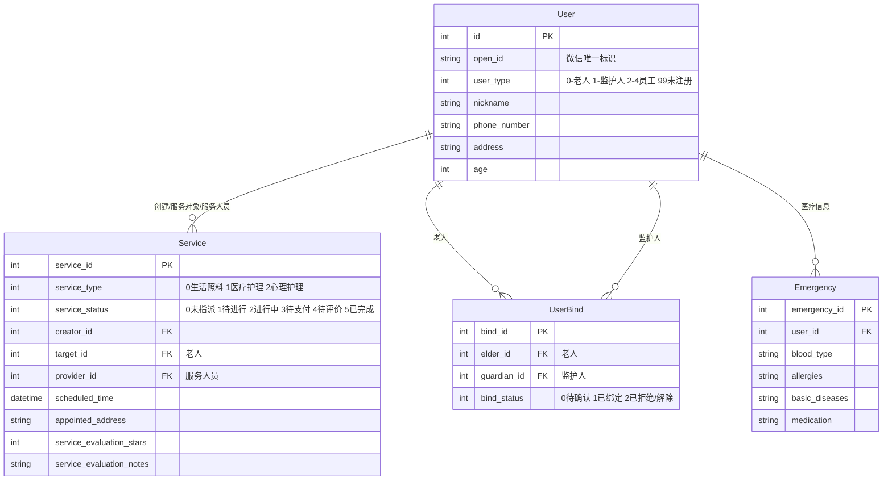

# 🏥 智慧养老微信小程序

> 连接老人、监护人与服务人员的智慧养老服务平台

---

## 📋 项目简介

面向老年人的智慧养老服务微信小程序，提供 **生活照料、医疗护理、心理护理** 三大类服务。支持三种核心角色：

| 角色 | 类型值 | 核心能力 |
|------|--------|---------|
| 👴 老人 | 0 | 享受服务、紧急呼救、查看医疗信息 |
| 👨‍👩‍👧 监护人 | 1 | 创建服务、绑定老人、监督服务质量 |
| 👷 服务人员 | 2/3/4 | 接收任务、执行服务、上传记录 |

---

## 🛠️ 技术栈

| 层级 | 技术 | 版本 |
|------|------|------|
| **前端** | 微信小程序（原生） | - |
| **后端** | Java + Spring Boot | 17 / 3.4.6 |
| **数据库** | Spring Data JPA + MySQL | 8.x |
| **认证** | JWT (jjwt) | 0.11.5 |
| **构建** | Maven（使用 mvnw wrapper） | - |
| **部署** | Docker（可选） | - |

---

## 🚀 快速开始（5分钟跑起来）

### 前置条件

| 工具 | 版本要求 | 验证命令 |
|------|---------|---------|
| Java | 17+ | `java --version` |
| Docker（可选） | 20+ | `docker --version` |
| 微信开发者工具 | 最新版 | - |

### 第一步：启动数据库

**方式一：使用 Docker（推荐，一行命令）**

```bash
docker compose up -d mysql
```

> 会自动下载 MySQL 8.0 镜像并创建 `MiniApp` 数据库，用户名/密码：`root/root`

**方式二：使用本地 MySQL**

```sql
CREATE DATABASE IF NOT EXISTS MiniApp DEFAULT CHARSET utf8mb4;
```

### 第二步：配置并启动后端

```bash
# ① 进入后端目录
cd 后端/mini_program_backend

# ② 复制配置模板（然后编辑填入自己的微信 appid/secret）
cp src/main/resources/application.properties.example src/main/resources/application.properties

# ③ 一键启动（mvnw 会自动下载 Maven 和依赖）
./mvnw spring-boot:run
```

> 首次启动会下载依赖，约 1~3 分钟。启动成功后控制台会显示 `Tomcat started on port 8081`。
> 数据库表会自动创建（JPA ddl-auto=update），无需手动建表。

### 第三步：启动前端

1. 打开 **微信开发者工具**
2. 点击 **"小程序项目"**
3. 项目目录选择：`前端/miniprogram-1/miniprogram-1`
4. AppID：填写你的微信小程序 AppID（或选择"测试号"）
5. 点击 **"确定"**

> 如果后端和前端不在同一台机器，修改 `前端/miniprogram-1/miniprogram-1/config.js` 中的 `baseUrl`。

### 第四步：验证

打开小程序 → 点击微信登录 → 选择角色注册 → 进入首页 → ✅ 成功！

---

## 📖 完整一键启动脚本

```bash
#!/bin/bash
# start.sh - 一键启动全部服务

echo "📦 启动 MySQL..."
docker compose up -d mysql
sleep 5

echo "🚀 启动后端..."
cd 后端/mini_program_backend
./mvnw spring-boot:run
```

> Windows 用户用 `mvnw.cmd spring-boot:run` 替代 `./mvnw spring-boot:run`

---

## 📁 项目结构

```
smart-elderly-care/
├── 前端/                              # 微信小程序前端
│   └── miniprogram-1/
│       ├── app.js                     # 全局入口
│       ├── app.json                   # 页面/路由配置
│       ├── config.js                  # API地址配置
│       └── pages/
│           ├── login/                 # 微信登录
│           ├── signup/                # 注册/完善信息
│           ├── index/                 # 首页
│           ├── info/                  # 个人中心
│           ├── service_list/          # 服务列表
│           ├── service_create/        # 创建服务
│           ├── service_detail/        # 服务详情
│           ├── service_evaluate/      # 服务评价
│           ├── bind_list/             # 绑定管理
│           ├── bind_edit/             # 添加绑定
│           ├── emergency/             # 紧急医疗信息
│           ├── emergency_info/        # 紧急呼救
│           ├── complaint/             # 投诉建议
│           └── accessibility/         # 适老化设置
│
├── 后端/                              # Spring Boot 后端
│   └── mini_program_backend/
│       ├── pom.xml                    # Maven依赖
│       ├── mvnw / mvnw.cmd            # Maven Wrapper
│       └── src/main/java/com/hecs/mini_program_backend/
│           ├── MiniProgramBackendApplication.java  # 启动类
│           ├── config/                # 配置类（微信/CORS）
│           ├── controller/            # 控制器（5个）
│           │   ├── LoginController.java
│           │   ├── SignUpController.java
│           │   ├── ServiceController.java
│           │   ├── BindController.java
│           │   └── EmergencyController.java
│           ├── entity/                # 实体类（4个）
│           ├── mapper/                # JPA Repository（4个）
│           ├── service/               # 业务逻辑层
│           └── utils/                 # 工具类（JWT）
│
├── docs/                              # 文档
│   ├── 项目技术文档.md
│   ├── 技术知识点总结.md
│   ├── API_Documentation.md
│   ├── test_case.md
│   └── 数据词典.pdf
│
├── docker-compose.yml                 # 一键启动数据库
├── .gitignore
└── README.md
```

---

## 🌐 API 接口一览

| 模块 | 方法 | 路径 | 说明 |
|------|------|------|------|
| **用户认证** | POST | `/login` | 微信登录（换取 JWT） |
| | POST | `/signup` | 注册/完善用户信息 |
| **服务管理** | GET | `/api/services` | 获取服务列表（分页） |
| | GET | `/api/services/{id}` | 获取服务详情 |
| | POST | `/api/services/create` | 创建服务 |
| | POST | `/api/services/update/{id}` | 更新服务 |
| | POST | `/api/services/cancel/{id}` | 取消服务 |
| | POST | `/api/services/evaluate/{id}` | 评价服务 |
| | POST | `/api/services/payment/{id}` | 支付服务 |
| **绑定管理** | GET | `/api/bindings` | 获取绑定列表 |
| | POST | `/api/bindings/create` | 创建绑定申请 |
| | PUT | `/api/bindings/{id}/status` | 更新绑定状态 |
| | POST | `/api/bindings/delete/{id}` | 解除绑定 |
| **紧急救助** | GET | `/api/emergency/info` | 获取紧急医疗信息 |
| | POST | `/api/emergency/update` | 更新紧急医疗信息 |
| | POST | `/api/emergency/help` | 发送紧急求助 |

> 完整接口文档见 [docs/API_Documentation.md](docs/API_Documentation.md)

---

## 💾 数据模型



---

## 🔐 安全说明

⚠️ **部署到生产环境前，请务必：**

1. **更换 JWT 密钥** — 修改 `application.properties` 中的 `jwt.secret`，使用 32 位以上的随机字符串
2. **修改数据库密码** — 不要使用默认密码
3. **替换微信 appid/secret** — 使用你在微信公众平台申请的小程序凭证
4. **开启 HTTPS** — 微信小程序要求接口必须是 HTTPS
5. **添加合法域名** — 在微信公众平台配置服务器域名白名单
6. **关闭 SQL 日志** — `spring.jpa.show-sql=false`

---

## 📄 开源协议

MIT License

---

## 👥 贡献

欢迎提交 Issue 或 Pull Request。

---

> **项目文档**：[docs/项目技术文档.md](docs/项目技术文档.md) | [docs/技术知识点总结.md](docs/技术知识点总结.md)
