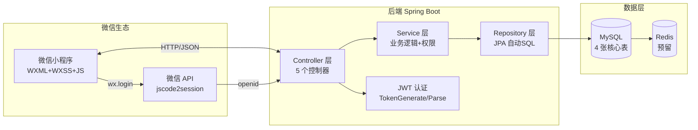

# 🏥 Smart Elderly Care — 智慧养老微信小程序

> **连接老人、监护人与服务人员的智慧养老服务平台。**  
> 基于 Spring Boot 3 + JPA + MySQL 构建后端，微信小程序原生开发前端，JWT 无状态认证。
> 支持服务全生命周期管理（创建→执行→支付→评价）、多角色权限控制、紧急救助、老人-监护人绑定关系。

---

## 1. 📌 项目一句话定位

**面向老年人的 O2O 智慧养老微信小程序** — 老人通过小程序获取生活照料、医疗护理、心理护理等服务；监护人可绑定老人并代为创建服务；服务人员接收并执行任务。覆盖从下单到评价的完整服务闭环。

---

## 2. 🖼️ Screenshots / Demo

| 角色 | 核心页面 |
|------|---------|
| 👴 老人 | 首页 · 紧急呼救 · 服务列表 · 紧急医疗信息 · 个人中心 |
| 👨‍👩‍👧 监护人 | 绑定管理 · 创建服务 · 服务列表 · 投诉建议 |
| 👷 服务人员 | 服务任务列表 · 服务详情 · 上传服务记录 |

> 📱 暂缺截图 — 需在微信开发者工具中运行后截取。  
> 📹 Demo 视频待录制。

**快速预览方式：**

```bash
# 方式一：微信开发者工具导入
打开 前端/miniprogram-1/miniprogram-1 → 点击编译

# 方式二：查看 API 文档了解接口设计
docs/API_Documentation.md
```

---

## 3. ⚡ Tech Highlights

### 后端

| 技术 | 版本 | 用途 |
|------|------|------|
| Java | 17 | 开发语言（LTS 长期支持） |
| Spring Boot | 3.4.6 | 应用框架（自动配置、内嵌 Tomcat） |
| Spring Data JPA (Hibernate) | — | ORM，方法名即 SQL，自动建表 |
| MySQL | 8.x | 关系型数据库 |
| JWT (jjwt) | 0.11.5 | 无状态认证令牌 |
| Hutool HTTP | 5.8.13 | 调用微信 jscode2session API |
| Lombok | 1.18.30 | `@Data` 消除 getter/setter 样板代码 |
| Maven Wrapper | — | 零全局依赖构建 |

### 前端

| 技术 | 用途 |
|------|------|
| 微信小程序原生 | WXML + WXSS + JavaScript（ES6） |
| 微信 SDK | 静默登录、GPS 定位、文件上传 |

### 系统部署

| 工具 | 用途 |
|------|------|
| Docker Compose | 一键启动 MySQL 8 数据库 |
| mvnw | 零安装 Maven 构建 |

### 核心架构决策

| 决策 | 方案 | 理由 |
|------|------|------|
| 认证方式 | **JWT 无状态令牌** | 适合小程序无 Cookie 环境；分布式部署无需共享 Session |
| ORM 框架 | **Spring Data JPA** | 表结构简单（4 张表），开发效率优先 |
| 密码存储 | 不涉及 | 使用微信 OAuth，后端不存密码 |
| API 风格 | RESTful | 资源导向 URL，HTTP 方法语义化 |
| 部署 | 单机 Spring Boot + Docker MySQL | 初期用户量小，够用；后续可水平扩展 |

---

## 4. 🏗️ Architecture / Code Map

### 系统架构



### 分层代码映射

```
请求 → Controller（接收/校验）→ Service（业务/权限）→ Repository（SQL）→ DB
```

### 数据模型 (ER 图)

```mermaid
erDiagram
    User ||--o{ Service : 创建/服务对象/服务人员
    User ||--o{ UserBind : 老人
    User ||--o{ UserBind : 监护人
    User ||--o{ Emergency : 医疗信息

    User { int id PK; string open_id; int user_type "0老人 1监护人 2-4员工 99未注册" }
    Service { int service_id PK; int service_type; int service_status "0未指派 ~ 5已完成"; int creator_id FK; int target_id FK; int provider_id FK; datetime scheduled_time }
    UserBind { int bind_id PK; int elder_id FK; int guardian_id FK; int bind_status "0待确认 1已绑定 2已拒绝" }
    Emergency { int emergency_id PK; int user_id FK; string blood_type; string allergies; string basic_diseases; string medication }
```

### 项目目录

```
smart-elderly-care/
├── 前端/miniprogram-1/           # 微信小程序（14 个页面）
│   └── pages/
│       ├── login/                # 微信静默登录
│       ├── signup/               # 角色注册
│       ├── index/                # 首页（角色感知）
│       ├── service_{list|create|detail|evaluate}/  # 服务模块
│       ├── bind_{list|edit}/     # 绑定管理
│       ├── emergency/            # 紧急医疗
│       └── accessibility/        # 适老化设置
├── 后端/mini_program_backend/    # Spring Boot 3.4.6
│   ├── controller/               # 5 个 @RestController
│   ├── entity/                   # 4 个 JPA @Entity
│   ├── mapper/                   # 4 个 JpaRepository
│   ├── service/                  # 业务逻辑层
│   ├── config/                   # 微信/CORS 配置
│   └── utils/                    # JWT 生成/解析
├── docs/                         # 完整文档
├── docker-compose.yml            # 一键 MySQL
└── README.md
```

### 服务状态流转

```
创建(0:未指派) → 指派(1:待进行) → 开始(2:进行中) → 完成(3:待支付)
→ 支付(4:待评价) → 评价(5:已完成)
```

---

## 5. 🚀 Quick Start

### 前置条件

| 工具 | 版本 | 验证 |
|------|------|------|
| Java | 17+ | `java --version` |
| Docker | 20+ | `docker --version` |
| 微信开发者工具 | 最新 | — |

### 一键启动（5 分钟）

```bash
# ① 克隆
git clone https://github.com/2002yy/smart-elderly-care.git
cd smart-elderly-care

# ② 启动数据库
docker compose up -d mysql

# ③ 配置后端
cd 后端/mini_program_backend
cp src/main/resources/application.properties.example \
   src/main/resources/application.properties
# 编辑 application.properties，填入你的微信 appid/secret

# ④ 启动后端（mvnw 自动下载依赖）
./mvnw spring-boot:run
# 看到 "Tomcat started on port 8081" 即成功
```

**前端运行：**

1. 打开 **微信开发者工具**
2. 项目目录 → `前端/miniprogram-1/miniprogram-1`
3. AppID → 填写正式 AppID 或选"测试号"
4. 点击 **编译**

> 💡 真机调试需将 `config.js` 中的 `localhost` 替换为电脑局域网 IP。

---

## 6. 🧪 Testing / CI

### 当前测试状态

| 类型 | 数量 | 覆盖范围 | 状态 |
|------|------|---------|------|
| 手工测试用例 | **38** 个 | 3 种角色 + 4 个功能模块 | ✅ 已设计 |
| 单元测试 | — | Service 层 | ⏳ 待补充 |
| 集成测试 | — | Controller + Repository | ⏳ 待补充 |
| CI 流水线 | — | GitHub Actions | ⏳ 待搭建 |

### 测试用例分布

| 角色/模块 | 用例数 | 覆盖场景 |
|-----------|--------|---------|
| 老人 (EL) | 22 | 登录注册、紧急救助、服务评价、绑定管理 |
| 监护人 (GU) | 14 | 绑定管理、代理创建服务、取消服务 |
| 员工 (ST) | 8 | 任务列表、接单、开始/完成服务 |
| 服务流程 (SE) | 6 | 完整流转、取消、修改、类型切换 |
| 其他 (OT) | 9 | 投诉、无障碍、网络异常、权限处理 |

### 测试文件

- 完整测试用例：[docs/test_case.md](docs/test_case.md)
- 系统测试记录表：[docs/马一博小组_系统测试用例与记录表.docx](docs/马一博小组_系统测试用例与记录表.docx)

### 未来 CI 规划

```yaml
# .github/workflows/ci.yml（规划中）
- mvn verify        # 单元测试 + 集成测试
- Checkstyle        # 代码风格检查
- docker compose up # 启动 MySQL 做集成测试
```

---

## 7. 📦 Release / Download

| 版本 | 日期 | 下载 | 说明 |
|------|------|------|------|
| v1.0.0 | 2026-05 | [GitHub Release](https://github.com/2002yy/smart-elderly-care/releases) | 初始版本 |
| — | — | 后端 JAR：`mvn package` 生成 `target/*.jar` | 需 Java 17 环境 |

> 📥 小程序端需在微信开发者工具中上传代码，通过微信公众平台审核后发布。

---

## 8. 🗺️ Roadmap

### ✅ 已实现

- [x] 微信静默登录 + JWT 无状态认证
- [x] 多角色注册（老人/监护人/员工）
- [x] 服务完整生命周期（创建→执行→支付→评价）
- [x] 老人-监护人双向绑定关系
- [x] 紧急救助（定位 + 医疗信息）
- [x] 14 个小程序页面 + 底部 TabBar
- [x] 后端 5 个 Controller、16 个 API 端点
- [x] 38 个手工测试用例
- [x] CORS 跨域支持

### 🔜 规划中

- [ ] **微信支付接入** — 当前为模拟支付（setTimeout 模拟）
- [ ] **紧急求助推送** — 对接微信模板消息或短信通知
- [ ] **服务人员自动指派** — 当前写死 providerId=5
- [ ] **单元测试覆盖** — @SpringBootTest + MockMvc
- [ ] **GitHub Actions CI** — 自动构建 + 测试
- [ ] **Docker 化后端** — 容器化一键部署
- [ ] **Redis 缓存** — 缓存用户信息、服务列表
- [ ] **服务搜索** — Elasticsearch 全文搜索

---

## 9. 📄 License / Notes

### License

**MIT License** — 自由使用、修改、分发。

### 安全注意事项

⚠️ 部署到生产环境前请务必：

| # | 操作 | 说明 |
|---|------|------|
| 1 | **更换 JWT 密钥** | 使用 32 位以上随机字符串 |
| 2 | **替换微信 appid/secret** | 微信公众平台申请 |
| 3 | **修改数据库密码** | 不要使用默认密码 |
| 4 | **开启 HTTPS** | 微信小程序强制要求 |
| 5 | **配置合法域名** | 微信公众平台添加白名单 |
| 6 | **关闭 SQL 日志** | `spring.jpa.show-sql=false` |
| 7 | **JWT 密钥移至环境变量** | 不要硬编码在源码中 |

### 行业分析

> 智慧养老是银发经济的重要赛道。中国 60 岁以上人口已超 2.8 亿，社区居家养老是主流模式。
> 本项目可作为智慧养老社区服务的基础数字化平台，可扩展对接智能硬件（健康手环、紧急按钮）和政府养老补贴系统。

### 文档索引

| 文档 | 说明 |
|------|------|
| [项目技术文档.md](docs/项目技术文档.md) | 业务流程、数据模型、API 总览 |
| [技术知识点总结.md](docs/技术知识点总结.md) | 全部技术要点 + 面试题 + 项目亮点 |
| [API_Documentation.md](docs/API_Documentation.md) | 接口地址、参数、响应格式 |
| [test_case.md](docs/test_case.md) | 38 个测试用例详情 |
| [数据词典.pdf](docs/数据词典.pdf) | 数据库字典 |

### 贡献

欢迎提交 Issue 或 Pull Request。  
养成良好习惯：提 PR 前先跑一遍测试用例。
