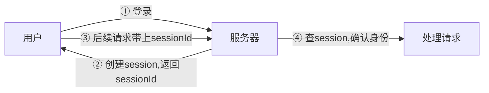

# 智慧养老小程序 — 技术知识点总结

> 基于项目的实际代码，讲解后端核心技术的原理与实践

---

## 目录

1. [Java 基础特性](#1-java-基础特性)
2. [Spring Boot 框架](#2-spring-boot-框架)
3. [JPA (Spring Data JPA)](#3-jpa-spring-data-jpa)
4. [JWT 认证机制](#4-jwt-认证机制)
5. [Session 与 Redis](#5-session-与-redis)
6. [RESTful API 设计规范](#6-restful-api-设计规范)
7. [接口文档与前后端联调](#7-接口文档与前后端联调)
8. [Spring Boot 的应用场景](#8-spring-boot-的应用场景)
9. [MySQL 数据库](#9-mysql-数据库)
10. [微信小程序](#10-微信小程序)
11. [深挖：Spring Boot 启动过程](#11-深挖spring-boot-启动过程)
12. [深挖：JPA 懒加载的坑](#12-深挖jpa-懒加载的坑)
13. [深挖：JWT 的安全隐患](#13-深挖jwt-的安全隐患)
14. [面试官视角：高频面试题](#14-面试官视角高频面试题)
15. [常见技术问题与解决方案](#15-常见技术问题与解决方案)
16. [完整请求链路示例](#16-完整请求链路示例)

---

## 1. Java 基础特性

### 为什么用 Java 17？

Java 17 是 **LTS（Long Term Support，长期支持版）**，官方提供多年维护更新。Spring Boot 3.x 强制要求 Java 17+。

### 项目里用到的 Java 特性

| 特性 | 说明 | 项目中的体现 |
|------|------|------------|
| **Lambda 表达式** | 简化匿名内部类写法 | `stream().map()/.filter()` 随处可见 |
| **Stream API** | 函数式操作集合 | `List → List` 的数据转换 |
| **Optional** | 空值安全处理 | 防止 NullPointerException |
| **注解 (Annotation)** | 元数据标记 | `@Entity`, `@Autowired`, `@RestController` |
| **泛型 (Generics)** | 类型安全 | `JpaRepository<User, Integer>` |

### 实际代码示例

```java
// Lambda + Stream 风格（LoginController.java:127-144）
List<Map<String, Object>> bindInfo = rawBinds.stream().map(bind -> {
    Map<String, Object> bindingMap = new HashMap<>();
    User partner = userService.getUserById(bind.getGuardianId());
    bindingMap.put("name", partner.getNickname());
    bindingMap.put("phone", partner.getPhoneNumber());
    return bindingMap;
}).collect(Collectors.toList());

// 等价于传统的 for 循环写法：
List<Map<String, Object>> bindInfo = new ArrayList<>();
for (Bind bind : rawBinds) {
    Map<String, Object> bindingMap = new HashMap<>();
    User partner = userService.getUserById(bind.getGuardianId());
    bindingMap.put("name", partner.getNickname());
    bindingMap.put("phone", partner.getPhoneNumber());
    bindInfo.add(bindingMap);
}
```

### Java 的优缺点与适用范围

#### 优点
| 优势 | 说明 |
|------|------|
| **生态庞大** | 全世界最大的开发者社区之一，几乎任何需求都有现成的库 |
| **类型安全** | 编译期检查类型错误，大型项目减少运行时崩溃 |
| **跨平台** | JVM 让同一份代码在 Windows/Linux/Mac 都能跑 |
| **性能优秀** | JIT 编译后接近 C++ 性能，远高于 Python/Node.js |
| **面向企业** | 事务、多线程、分布式这些企业级需求都有成熟的方案 |
| **长期稳定** | Oracle 提供 LTS 版本，一个版本维护好多年 |

#### 缺点
| 劣势 | 说明 |
|------|------|
| **代码冗长** | 同样的功能，Java 代码量是 Python 的 2~3 倍（Lombok 能缓解） |
| **启动慢** | Spring Boot 应用启动需要几秒到几十秒（GraalVM 可以优化） |
| **内存占用高** | JVM 默认占用几百 MB 内存，不适合轻量场景 |
| **学习曲线陡** | 要学的东西多：JVM、多线程、设计模式、框架生态 |
| **开发效率相对低** | 修改代码 → 编译 → 重启，循环比动态语言慢 |

#### 什么时候用 / 不用 Java

| 适合用 Java | 不适合用 Java |
|------------|--------------|
| 大型企业级系统（ERP/OA/电商） | 简单的脚本/批处理（用 Python） |
| 高并发、高可用的后端服务 | 快速原型验证（用 Node.js） |
| 金融/银行/保险等对稳定性要求高的系统 | IO 密集型场景（用 Go/Node.js 更省资源） |
| 微服务架构（配合 Spring Cloud） | 前端全栈项目（用 Node.js 统一语言） |
| Android 原生开发 | 系统编程/嵌入式（用 C/C++/Rust） |

#### 常用后端语言对比

| 维度 | Java | Go | Python | Node.js |
|------|------|----|--------|---------|
| 性能 | ⭐⭐⭐⭐⭐ | ⭐⭐⭐⭐⭐ | ⭐⭐⭐ | ⭐⭐⭐⭐ |
| 开发效率 | ⭐⭐⭐ | ⭐⭐⭐⭐ | ⭐⭐⭐⭐⭐ | ⭐⭐⭐⭐ |
| 学习难度 | ⭐⭐⭐ | ⭐⭐⭐ | ⭐⭐ | ⭐⭐ |
| 生态成熟度 | ⭐⭐⭐⭐⭐ | ⭐⭐⭐ | ⭐⭐⭐⭐ | ⭐⭐⭐⭐ |
| 企业采用率 | ⭐⭐⭐⭐⭐ | ⭐⭐⭐ | ⭐⭐⭐ | ⭐⭐⭐ |
| 内存占用 | 高 | 低 | 中 | 中 |
| 启动速度 | 慢 | 快 | 快 | 快 |

---

## 2. Spring Boot 框架

### 2.1 核心思想：约定大于配置

Spring Boot 自动为你配置好一切（内嵌 Tomcat、JSON 转换、数据库连接池等），你只需要关注业务代码。

### 2.2 典型的分层架构

```
请求进来 →
  Controller  (接收HTTP请求/返回JSON响应)
       ↓
  Service     (业务逻辑处理)
       ↓
  Repository  (数据库操作，JPA自动生成SQL)
       ↓
  Entity      (数据模型，一张表 = 一个Java类)
```

### 2.3 项目中 5 个 Controller 及其职责

| Controller | 请求路径 | 职责 |
|-----------|---------|------|
| `LoginController` | `/login` | 微信登录（调微信API获取openid，生成JWT） |
| `SignUpController` | `/signup` | 用户注册/完善资料/注销 |
| `ServiceController` | `/api/services/*` | 服务增删改查 + 评价 + 支付 |
| `BindController` | `/api/bindings/*` | 老人-监护人绑定关系管理 |
| `EmergencyController` | `/api/emergency/*` | 紧急医疗信息 + 发送求助 |

### 2.4 @SpringBootApplication 是什么？

```java
@SpringBootApplication  // 等价于下面三个注解的集合
@SpringBootConfiguration  // 标记为配置类，可在此定义 Bean
@EnableAutoConfiguration  // 自动配置（根据引入的依赖"猜"你要用什么）
@ComponentScan           // 自动扫描同包及子包的 @Component

public class MiniProgramBackendApplication {
    public static void main(String[] args) {
        SpringApplication.run(MiniProgramBackendApplication.class, args);
        // 启动内嵌Tomcat，自动装配所有组件
    }
}
```

### 2.5 Spring Boot 的优缺点与适用范围

#### 优点
| 优势 | 说明 |
|------|------|
| **快速开发** | 自动配置、起步依赖，一个注解顶几十行配置 |
| **生态丰富** | Spring 全家桶（Security/Cloud/Data/...）任意组合 |
| **约定大于配置** | 大多数场景零配置直接跑 |
| **内嵌服务器** | 不用装 Tomcat，`java -jar` 直接运行 |
| **生产就绪** | Actuator 提供监控、健康检查、指标等开箱即用 |
| **社区巨大** | 遇到问题几乎都能搜到答案 |
| **易于测试** | `@SpringBootTest` 提供完善的测试支持 |

#### 缺点
| 劣势 | 说明 |
|------|------|
| **启动慢** | 首次启动几秒到几十秒，开发体验受影响 |
| **内存占用高** | 基础应用就要 200~300MB 内存 |
| **配置复杂** | 自动配置虽然方便，出问题排查困难（"魔法"太多） |
| **版本兼容问题** | Spring Boot + 各依赖库的版本搭配需要仔细对应 |
| **重** | 一个小 API 也要引入大量依赖，不适合轻量场景 |
| **学习曲线陡** | 除了框架本身，还要学 AOP、IoC、设计模式等概念 |

#### 什么时候用 / 不用 Spring Boot

| 适合用 Spring Boot | 不适合用 Spring Boot |
|-------------------|---------------------|
| 复杂业务逻辑的企业系统 | 简单的 CRUD 接口（用 Express/FastAPI 更轻） |
| 需要事务/安全/监控的生产环境 | 高吞吐、低延迟的网关服务（考虑 Go/Netty） |
| 微服务架构 | 函数计算/Serverless（Spring Boot 启动太慢） |
| 已有 Java 技术栈的团队 | 团队全是前端/全栈（Node.js 更合适） |
| 长期维护的大型项目 | 快速原型、Hackathon 项目（太重了） |

#### 主流后端框架对比

| 维度 | Spring Boot (Java) | Gin (Go) | FastAPI (Python) | Express (Node.js) |
|------|-------------------|----------|-----------------|-------------------|
| 启动时间 | 3~10 秒 | < 1 秒 | < 1 秒 | < 1 秒 |
| 内存占用 | ~200MB 起 | ~10MB | ~50MB | ~30MB |
| 开发效率 | 中等 | 高 | 很高 | 高 |
| 企业特性 | 最完善 | 基础 | 基础 | 基础 |
| 适合项目 | 大型企业级 | 微服务/API网关 | AI/数据分析API | 全栈/初创项目 |
| 学习成本 | 高 | 中 | 低 | 低 |

### 2.6 Spring Boot 自动配置了什么？（你自己一行没写但已经在用的）

| 组件 | 自动配置 | 项目中体现 |
|------|---------|-----------|
| **内嵌 Tomcat** | 无需安装 Web 服务器 | `java -jar` 直接跑 |
| **Jackson JSON 转换** | 自动将 Java 对象 ↔ JSON | `@RestController` 返回对象自动变 JSON |
| **CORS 跨域** | WebConfig 配置 | 允许前端跨域访问 |
| **HikariCP 连接池** | Spring Boot 默认 | 数据库连接池（业界最快） |
| **事务管理** | `@Transactional` | 数据库操作自动事务 |
| **日志 (SLF4J + Logback)** | 自动配置 | `LoggerFactory.getLogger()` 直接可用 |

### 2.6 项目中的关键注解

| 注解 | 作用 | 项目中的位置 |
|------|------|------------|
| `@RestController` | 标记类为控制器，方法返回值自动转 JSON | 所有 Controller |
| `@RequestMapping` | 设置请求路径前缀 | `@RequestMapping("/api/services")` |
| `@GetMapping` / `@PostMapping` | 设置 HTTP 方法和路径 | 各 Controller 方法 |
| `@RequestBody` | 将请求体 JSON 自动转为 Java 对象 | 接收前端参数 |
| `@PathVariable` | 从 URL 路径中取值 | `/api/services/{id}` |
| `@RequestHeader` | 从请求头中取值 | 获取 Authorization token |
| `@RequestParam` | 从 URL 查询参数中取值 | 分页参数 page/pageSize |
| `@Autowired` | 自动注入依赖对象 | 注入 Service、Repository |
| `@Service` / `@Repository` | 标记为 Spring 管理的 Bean | ServiceImpl 和 Repository |

---

## 3. JPA (Spring Data JPA)

### 3.1 是什么？

JPA = Java Persistence API。Spring Data JPA 是它的实现，核心卖点：**方法名即 SQL**。

你定义一个接口方法名，JPA 自动生成对应的 SQL 语句，不用手写 SQL。

### 3.2 实体映射（Entity）

```java
@Entity                     // 告诉 Spring：这个类对应数据库一张表
@Table(name = "user")       // 指定映射到的表名
public class User {
    @Id
    @GeneratedValue(strategy = GenerationType.IDENTITY)  // 自增主键
    private Integer id;

    @Column(name = "open_id")   // 映射到 open_id 列
    private String openId;       // 驼峰命名自动转下划线？这里显式指定了
    
    @Column(name = "user_type")
    private Integer userType;    // 0=老人, 1=监护人, 2/3/4=员工, 99=未注册
}
```

### 3.3 方法名自动生成 SQL 的原理

```java
public interface UserRepository extends JpaRepository<User, Integer> {
    //                      ↑ 实体类型     ↑ 主键类型
    
    User findByOpenId(String openId);
    // JPA 解析为：SELECT * FROM user WHERE open_id = ?
    
    User findByPhoneNumber(String phoneNumber);
    // 解析为：SELECT * FROM user WHERE phone_number = ?
}

public interface ServiceRepository extends JpaRepository<Service, Integer> {
    Page<Service> findByCreatorIdOrTargetId(Integer creatorId, Integer targetId, Pageable pageable);
    // 解析为：SELECT * FROM service 
    //         WHERE creator_id = ? OR target_id = ?
    //         LIMIT ? OFFSET ?
}
```

**方法名解析规则详解：**
```
findBy     +  CreatorId    +  Or     +  TargetId
SELECT *      WHERE creator_id = ?   OR    target_id = ?
```

**支持的关键词：**
- `And` / `Or` — 逻辑组合
- `IsNull` / `IsNotNull` — 空判断
- `Like` / `NotLike` — 模糊查询
- `Between` — 范围查询
- `LessThan` / `GreaterThan` — 大小比较
- `OrderBy` — 排序：`findByAgeOrderByNameDesc`
- `Top` / `First` — 限制条数：`findTop10ByName`

### 3.4 内置 CRUD 方法

继承 `JpaRepository` 就自带，不用自己写：

```java
repository.save(entity)           // 新增或更新（有ID=更新，无ID=新增）
repository.findById(id)           // 按主键查（返回Optional）
repository.findAll()              // 查全部
repository.findAll(pageable)      // 分页查询
repository.deleteById(id)         // 按主键删
repository.count()                // 总数
repository.existsById(id)         // 是否存在
```

### 3.5 DDL 自动建表

配置文件中的关键行：

```properties
spring.jpa.hibernate.ddl-auto=update
```

含义：
- `update`：启动时自动对比 Entity 和数据库表，缺字段就加，缺表就建
- `create`：每次启动先删表再重建（开发用，数据会丢）
- `validate`：只验证，不修改
- `none`：关闭自动建表（生产环境推荐）

### 3.6 JPA 与 MyBatis 对比（Java 两大数据库框架）

| 维度 | Spring Data JPA (Hibernate) | MyBatis |
|------|---------------------------|---------|
| **本质** | ORM（对象关系映射） | SQL 映射框架 |
| **SQL 谁写** | JPA 自动生成 | 开发者手写 SQL |
| **开发效率** | ⭐⭐⭐⭐⭐ 几乎不用写SQL | ⭐⭐⭐ 需要手写所有SQL |
| **SQL 优化** | ⭐⭐⭐ 复杂SQL难优化 | ⭐⭐⭐⭐⭐ 精确控制每条SQL |
| **学习曲线** | ⭐⭐⭐ 理解JPA机制需要时间 | ⭐⭐⭐⭐ SQL好懂 |
| **表结构复杂** | ⭐⭐ 多表关联不够直观 | ⭐⭐⭐⭐⭐ 任意复杂关联 |
| **性能调优** | ⭐⭐ N+1问题、懒加载陷阱多 | ⭐⭐⭐⭐⭐ 全手工控制 |
| **项目变更** | ⭐⭐⭐⭐⭐ 改字段只需改Entity | ⭐⭐ 还要改XML里的SQL |

#### 什么时候选 JPA

- 表结构相对简单、关联不太复杂
- 开发效率优先，不想写大量重复 SQL
- 需求变化频繁，表结构经常调整
- 团队对 JPA/Hibernate 有经验

#### 什么时候选 MyBatis

- 复杂查询、多表关联、报表统计
- 已经存在的数据库表，结构不合理需要优化SQL
- 对 SQL 执行效率有极致要求
- 遗留系统迁移，SQL 已经写好

#### 项目中的混合方案（很多大厂这样用）

```
简单 CRUD → JPA（快速开发，零SQL）
复杂查询 → MyBatis（精确控制，性能最优）
```

本项目所有数据库操作都用的 JPA，因为表结构简单（4张表），关联也不复杂。

### 3.7 N+1 查询问题（项目中的坑）

看项目代码（LoginController.java:127-144）：

```java
List<Map<String, Object>> bindInfo = rawBinds.stream().map(bind -> {
    // 这一步：每循环一次就查一次数据库！
    User partner = userService.getUserById(bind.getGuardianId());
    bindingMap.put("name", partner.getNickname());
    return bindingMap;
}).collect(Collectors.toList());
```

- **N+1 问题**：1 次主查询（查绑定列表）+ N 次附加查询（查每个绑定对象的用户信息）
- 如果用户有 10 个绑定关系，就多查 10 次数据库
- 优化方案：`@EntityGraph`、`JOIN FETCH` 或批量查询后手动组装

### 3.7 JPA 配置完整说明

```properties
# 显示生成的 SQL（方便调试）
spring.jpa.show-sql=true
# SQL 格式化
spring.jpa.properties.hibernate.format_sql=true
# 指定数据库方言
spring.jpa.properties.hibernate.dialect=org.hibernate.dialect.MySQLDialect
```

---

## 4. JWT 认证机制

### 4.1 什么是 JWT？

JWT = JSON Web Token。一种**自包含的令牌**格式，将用户信息加密编码到 token 字符串中，服务器无需存储 session。

### 4.2 为什么这个项目用 JWT 而不是 Session？

| 方案 | 问题 |
|------|------|
| **传统 Session** | 存在服务器内存，多台服务器不共享；微信小程序没有 cookie 机制 |
| **JWT** | 无状态，所有信息都在 token 里，小程序手动传 header 即可 |

### 4.3 JWT 的组成

一个 JWT token 长这样：
```
eyJhbGciOiJIUzI1NiJ9.eyJvcGVuaWQiOiJvV0...  （一串乱码）
```

被 `.` 分成三部分：

```
[头部 Header] . [载荷 Payload] . [签名 Signature]
```

| 部分 | 内容 | 说明 |
|------|------|------|
| **Header** | `{"typ":"JWT","alg":"HS256"}` | 令牌类型、加密算法 |
| **Payload** | `{"openid":"xxx","user_type":0,"exp":...}` | 自定义数据（不要放密码！只是base64编码，没加密） |
| **Signature** | `HMACSHA256(base64(header)+"."+base64(payload), secret)` | 防篡改签名 |

### 4.4 项目中的 JWT 流程

```
┌──────────────────────────────────────────────────────────┐
│ 1. 前端 wx.login() → 拿到临时 code                        │
│ 2. 后端调微信 API (jscode2session)，用 code 换 openid     │
│ 3. 后端生成 JWT，里面存了 openid + userType               │
│ 4. 返回前端，存到 wx.setStorageSync('token')              │
│ 5. 后续每次请求 header 带 Authorization: Bearer <token>   │
│ 6. 后端解析 token，取出 openid，就知道是谁了               │
└──────────────────────────────────────────────────────────┘
```

### 4.5 生成 Token（TokenGenerate.java）

```java
public String TokenGenerate(String openid, Integer userType) {
    SecretKey key = Keys.hmacShaKeyFor("签名密钥".getBytes(UTF_8));
    
    String jwtToken = Jwts.builder()
        .setHeaderParam("typ", "JWT")          // 头部：类型
        .setHeaderParam("alg", "HS256")        // 头部：算法
        .claim("openid", openid)               // 载荷：自定义数据
        .claim("user_type", userType)          // 载荷：用户类型
        .setExpiration(new Date(System.currentTimeMillis() + 3600000))  // 1小时过期
        .signWith(key, SignatureAlgorithm.HS256) // 用密钥签名
        .compact();                              // 生成最终字符串
    return jwtToken;
}
```

### 4.6 解析 Token（TokenParse.java）

```java
public void parseToken(String token) {
    SecretKey key = Keys.hmacShaKeyFor(signature.getBytes(UTF_8));
    
    Jws<Claims> jws = Jwts.parserBuilder()
        .setSigningKey(key)           // 用同样的密钥验证签名
        .build()
        .parseClaimsJws(token);       // 解析（过期自动抛异常）
    
    Claims claims = jws.getBody();
    openid = claims.get("openid").toString();         // 取出 openid
    userType = Integer.parseInt(claims.get("user_type").toString()); // 取出类型
}
```

### 4.7 JWT 的优缺点

| 优点 | 缺点 |
|------|------|
| ✅ 无状态，服务器不用存，水平扩展简单 | ❌ token 签发后无法撤销，过期前一直有效 |
| ✅ 适合分布式/微服务架构 | ❌ token 体积比 sessionId 大 |
| ✅ 跨语言（任何语言都能解析验证） | ❌ 敏感信息别放 payload（只是 base64 编码） |
| ✅ 减少数据库查询（用户信息在 token 里） | ❌ 密钥泄露所有人 token 都可伪造 |

### 4.8 三种认证方案对比

| 维度 | Session | JWT | Session + Redis |
|------|---------|-----|-----------------|
| **存储位置** | 服务器内存 | 客户端（token 本身） | Redis（共享内存） |
| **扩展性** | ❌ 多机需额外方案 | ✅ 天然支持 | ✅ Redis 集中存储 |
| **撤销能力** | ✅ 服务器直接删 session | ❌ 需配合黑名单机制 | ✅ 删 Redis 中的 session |
| **性能** | ⭐⭐⭐ 查内存 | ⭐⭐⭐⭐ 验证签名即可 | ⭐⭐⭐ 查 Redis 有网络开销 |
| **安全性** | ⭐⭐⭐⭐ | ⭐⭐⭐（payload 可解码） | ⭐⭐⭐⭐ |
| **适用场景** | 单体应用 | 分布式/微服务/小程序 | 多服务器集群 |
| **实现复杂度** | ⭐ 简单 | ⭐⭐⭐ 需配置密钥/过期 | ⭐⭐ 需搭建 Redis |

#### 本项目的选择分析

项目用了 **JWT**，原因：
- 微信小程序没有 cookie，JWT 可以手动传 header
- 后续可能多服务器部署，JWT 天然支持
- 用户量初期不大，token 撤销问题不突出

#### 什么时候用哪种？

| 场景 | 推荐方案 |
|------|---------|
| 单体 Web 应用（传统 MVC） | Session（最简单） |
| 微信小程序 / 移动 App | JWT（无 cookie 场景） |
| 多服务器集群 | Session + Redis |
| 微服务架构 | JWT（服务间无需共享 session） |
| 高安全要求（银行/金融） | Session + Redis（可主动撤销） |

### 4.9 项目中的安全注意点

当前硬编码签名密钥在代码中：
```java
private final String signature = "com.hecs.mini_program_backend.utils";
```

生产环境应该：
1. 放在配置文件 `application.properties` 中
2. 使用足够长（至少 256 位）的随机密钥
3. 定期轮换密钥

---

## 5. Session 与 Redis

### 5.1 Session 是什么？

Session 是**传统的登录态管理方案**。

#### 工作原理



#### 通俗理解

去健身房办卡 → 前台给你一张实体卡（sessionId）→ 以后每次去刷卡（传sessionId）→ 前台电脑查到你的信息（session）→ 放行

#### 代码实现

```java
// 登录成功后
HttpSession session = request.getSession();
session.setAttribute("userId", 123);
session.setAttribute("userType", 0);

// 后续请求从 session 取数据
Integer userId = (Integer) request.getSession().getAttribute("userId");
```

#### Session 的问题

| 问题 | 说明 |
|------|------|
| **存在服务器内存** | 用户越多，占内存越大 |
| **多服务器不共享** | 登录在A服务器，下次请求到B服务器，不认识你 |
| **小程序无 cookie** | 微信小程序不是浏览器，没法自动带 sessionId |
| **扩展性差** | 加机器要解决 session 共享问题 |

### 5.2 Redis 是什么？

Redis = **Remote Dictionary Server**（远程字典服务）

本质：**运行在内存里的键值对数据库**，读写速度是 MySQL 的 **10~100 倍**。

| 对比项 | MySQL | Redis |
|--------|-------|-------|
| **数据存储** | 硬盘（关机不丢） | 内存（关机丢，可配置持久化） |
| **读写速度** | 几毫秒~几十毫秒 | 微秒级 |
| **数据结构** | 表（行+列） | 键值对、列表、集合、哈希 |
| **典型容量** | GB~TB | MB~GB（受内存限制） |

### 5.3 在这个项目中 Redis 可以用在哪

| 场景 | Redis 方案 | 现状（无 Redis） |
|------|-----------|----------------|
| **缓存用户信息** | `SET user:123 → 用户JSON，EX 3600` | 每次请求重复查 MySQL |
| **Session 共享** | 多台服务器共用一个 Redis | 无法多机部署 |
| **JWT 黑名单** | 用户注销时 `SET blacklist:token → 1，EX剩余时间` | token 发出后无法撤销 |
| **紧急求助队列** | `LPUSH emergency:queue → 求助消息`，后台异步处理 | 同步处理，阻塞请求 |
| **接口限流** | `INCR login:次数 EX 60`，超限拒绝 | 无防护，可被暴力攻击 |
| **缓存配置数据** | 服务类型等几乎不变的数据放 Redis | 每次查数据库 |

### 5.4 Redis 典型使用模式：缓存穿透保护

```
请求来了
   ↓
① 查 Redis → 有？直接返回（微秒级响应）
   ↓ 没有？
② 查 MySQL → 有？
   ├─ 写入 Redis（设置过期时间）
   └─ 返回数据
   ↓ 也没有？
③ 返回空结果（可缓存空值防穿透）
```

### 5.5 Redis 的优缺点

#### 优点
| 优势 | 说明 |
|------|------|
| **速度极快** | 纯内存操作，读写微秒级，比 MySQL 快 10~100 倍 |
| **数据结构丰富** | 字符串、列表、集合、有序集合、哈希、位图、HyperLogLog 等 |
| **原子操作** | INCR/DECR 等操作天然原子性，适合计数器/限流 |
| **发布订阅** | 内置 Pub/Sub 机制，可做简单的消息队列 |
| **持久化** | RDB（快照）和 AOF（日志）两种方式可选 |
| **高可用** | 主从复制 + Sentinel 哨兵实现自动故障转移 |
| **分布式** | Redis Cluster 自动分片，支持水平扩展 |

#### 缺点
| 劣势 | 说明 |
|------|------|
| **内存成本高** | 数据全在内存，1GB 数据需要 1GB 内存（云上 Redis 比 MySQL 贵很多） |
| **容量有限** | 受物理内存限制，不适合存储大量历史数据 |
| **持久化有风险** | 宕机可能丢失少量数据（取决于配置） |
| **不支持复杂查询** | 不能像 SQL 那样 JOIN、GROUP BY、子查询 |
| **无访问控制** | 早期版本无用户权限管理，容易出安全问题 |
| **单线程模型** | 单个命令快，但批量操作或大 key 会阻塞 |

#### 什么时候用 / 不用 Redis

| 适合用 Redis | 不适合用 Redis |
|------------|--------------|
| 缓存热点数据（用户信息、配置） | 存储系统核心数据（用 MySQL/PostgreSQL） |
| 排行榜/计数器 | 复杂关系查询 |
| Session 共享 | 大数据量分析（用 Elasticsearch/ClickHouse） |
| 消息队列（轻量级） | 消息可靠性要求极高（用 RabbitMQ/Kafka） |
| 分布式锁 | 数据量超过内存容量 |
| 接口限流/防刷 | 需要长期归档的历史数据 |

### 5.6 缓存技术选型对比

| 维度 | Redis | Memcached | Local Cache (Caffeine) |
|------|-------|-----------|----------------------|
| **存储位置** | 独立服务器 | 独立服务器 | 应用进程内 |
| **速度** | 微秒级（网络IO） | 微秒级 | 纳秒级（最快） |
| **数据结构** | 丰富（8种以上） | 仅字符串 | 取决于实现 |
| **持久化** | ✅ 支持 | ❌ 不支持 | ❌ 不支持 |
| **分布式** | ✅ Cluster | ❌ 需客户端实现 | ❌ 进程隔离 |
| **适用场景** | 共享缓存/分布式 | 简单 key-value 缓存 | 单机热点缓存 |
| **复杂度** | 中（需搭建维护） | 低 | 最低（依赖引入即用） |

### 5.7 为什么本项目没有用 Redis？

从小程序项目的规模和复杂度看，确实还不需要 Redis：
- 用户量不大，MySQL 完全扛得住
- 单机部署，没有 session 共享问题
- 紧急求助功能还只是半成品，后续完善时可以考虑

---

## 6. RESTful API 设计规范

> RESTful API 是当前最主流的 Web API 设计风格。本项目后端提供的所有接口都遵循 RESTful 风格。
> 本节从规范、实践、本项目的实际设计三个层面讲解。

### 6.1 什么是 RESTful API？

REST = Representational State Transfer（表征状态转移）

**核心思想：**
```
用 HTTP 方法（动词）操作资源（名词）

GET    /api/users      → 查询用户列表
GET    /api/users/1    → 查询某个用户
POST   /api/users      → 创建用户
PUT    /api/users/1    → 全量更新用户
PATCH  /api/users/1    → 部分更新用户
DELETE /api/users/1    → 删除用户
```

**6 个原则：**
1. **资源导向** — URL 表示资源，不是操作（`/api/services` 而不是 `/api/getServices`）
2. **HTTP 动词表示操作** — GET/POST/PUT/DELETE 对应查/增/改/删
3. **无状态** — 每个请求包含所有必要信息，服务端不存客户端状态（JWT 满足此原则）
4. **统一接口** — 所有资源用相同的方式操作
5. **可缓存** — 响应可标记是否可缓存
6. **分层系统** — 客户端不知道它连的是最终服务器还是中间层

### 6.2 HTTP 方法使用规范

| 方法 | 含义 | 幂等 | 安全 | 本项目用法 |
|------|------|------|------|-----------|
| **GET** | 查询资源 | ✅ 是 | ✅ 是 | 查询服务列表、详情、绑定列表 |
| **POST** | 创建资源 | ❌ 否 | ❌ | 创建服务、绑定、登录、注册、评价 |
| **PUT** | 全量更新 | ✅ 是 | ❌ | 更新绑定状态（本项目用 PUT） |
| **PATCH** | 部分更新 | ✅ 是 | ❌ | 未使用 |
| **DELETE** | 删除资源 | ✅ 是 | ❌ | 未使用（本项目用 POST /cancel） |

> **幂等**：同一个请求执行多次和执行一次效果相同
> **安全**：请求不会改变服务器状态

**本项目代码检查结果：**
```java
// ✅ 符合 RESTful：用 GET 查资源
@GetMapping("")           // GET /api/services
@GetMapping("/{id}")      // GET /api/services/1

// ⚠️ 不完全符合：创建用 POST 没问题，但更新也用了 POST
@PostMapping("/update/{id}")    // 标准应该是 PUT /api/services/1
@PostMapping("/cancel/{id}")    // 标准应该是 DELETE /api/services/1
@PostMapping("/evaluate/{id}")  // 可接受（属于"动作"）
@PostMapping("/payment/{id}")   // 可接受（属于"动作"）
```

**为什么项目很多地方用 POST 而不是 PUT/DELETE？**
- 微信小程序 `wx.request()` 对 PUT/DELETE 支持不如 POST 友好
- 有些框架/浏览器对 PUT/DELETE 请求有限制
- 实践中 POST 更通用，不易出错

### 6.3 URL 命名规范

```
✅ 正确风格：
  GET    /api/services          # 资源复数名词
  GET    /api/services/1        # 路径参数
  POST   /api/services/create   # 资源 + 动作
  
❌ 错误风格：
  GET    /api/getServiceList    # URL 中出现动词
  GET    /api/service/list      # 单数/复数混用
  POST   /api/updateService     # 动词开头
  GET    /api/services?id=1     # 用查询参数代替路径参数
```

**本项目 URL 分析：**

| 端点 | 是否符合 | 说明 |
|------|---------|------|
| `POST /login` | ✅ | 认证接口 |
| `POST /signup` | ✅ | 注册接口 |
| `GET /api/services` | ✅ | 标准 REST 风格 |
| `POST /api/services/create` | ✅ 可接受 | 明确语义 |
| `POST /api/services/update/{id}` | ⚠️ 应为 PUT | 但有合理解释 |
| `POST /api/services/cancel/{id}` | ✅ | 动作型接口 |
| `GET /api/bindings` | ✅ | 标准 |
| `PUT /api/bindings/{id}/status` | ✅ | 标准 |
| `GET /api/emergency/info` | ✅ | 标准 |
| `POST /api/emergency/help` | ✅ | 动作型接口 |

### 6.4 HTTP 状态码

| 状态码 | 含义 | 本项目出现场景 |
|--------|------|--------------|
| **200 OK** | 请求成功 | 正常查询、更新、评价 |
| **201 Created** | 创建成功 | 创建服务、绑定 |
| **400 Bad Request** | 参数错误 | 缺少必填字段、格式错误 |
| **401 Unauthorized** | 未认证 | Token 缺失或过期 |
| **403 Forbidden** | 无权限 | 操作不属于自己的资源 |
| **404 Not Found** | 资源不存在 | 服务/用户不存在 |
| **409 Conflict** | 资源冲突 | 绑定关系已存在 |
| **500 Internal Server Error** | 服务器错误 | 未捕获的异常 |

**项目代码示例（ServiceController.java:178-210）：**
```java
@PostMapping("/create")
public ResponseEntity<?> createService(...) {
    // 校验失败 → 400
    if (body.get("targetId") == null) {
        return ResponseEntity.status(HttpStatus.BAD_REQUEST)
            .body(Map.of("message", "服务对象ID不能为空"));
    }
    // 创建成功 → 201
    Service created = serviceService.createService(service);
    return ResponseEntity.status(HttpStatus.CREATED)
        .body(Map.of("success", true, "message", "创建服务成功"));
}
```

### 6.5 统一响应格式

本项目没有统一的响应包装类。当前返回格式不一致：

```json
// 成功时（不统一）：
{ "token": "...", "userInfo": {...}, "serviceInfo": [...] }     // /login
{ "success": true, "message": "创建成功", "service": {...} }     // /create
{ "data": [...], "total": 10, "page": 1, "pageSize": 10 }       // /services

// 失败时：
{ "message": "用户不存在" }                                       // 401
{ "message": "服务对象ID不能为空" }                                // 400
```

**推荐的统一响应格式：**
```java
public class ApiResponse<T> {
    private int code;       // 业务状态码
    private String message; // 提示信息
    private T data;         // 数据（泛型）
    
    public static <T> ApiResponse<T> success(T data) {
        return new ApiResponse<>(200, "success", data);
    }
    
    public static <T> ApiResponse<T> error(int code, String message) {
        return new ApiResponse<>(code, message, null);
    }
}

// 使用：
return ResponseEntity.ok(ApiResponse.success(serviceList));
return ResponseEntity.badRequest().body(ApiResponse.error(400, "参数错误"));
```

### 6.6 本项目 API 设计可改进点

| 问题 | 当前 | 改进建议 |
|------|------|---------|
| **状态码 HTTP 和业务码混用** | 用 HTTP 状态码表示业务结果 | 统一返回 200，用业务 code 区分 |
| **返回字段不统一** | 各接口字段名不一致（id/serviceId、type/serviceType） | 统一使用小驼峰命名 |
| **错误信息格式不统一** | 有的返回字符串，有的返回 Map | 使用统一的 ApiResponse |
| **缺少分页信息** | 服务列表有分页但其他接口没有 | 分页响应统一包含 page/total/pageSize |
| **嵌套层级不一致** | 数据有时在 data 字段，有时直接返回 | 统一嵌套结构 |

---

## 7. 接口文档与前后端联调

> 前后端分离开发中，接口文档是前后端协作的"契约"。
> 本节讲解接口文档的作用、本项目已有的文档、前后端联调的流程和常见问题。

### 7.1 为什么需要接口文档？

```
传统开发（前后端不分离）：
  前端写好 HTML → 后端套模板 → 联调

前后端分离开发：
  前端  →  接口文档（契约）  ←  后端
  （Vue/小程序）            （Spring Boot）
  各自独立开发 → 按文档对接 → 联调
```

**没有接口文档的痛点（本项目最初可能遇到的问题）：**
- 前端不知道后端返回什么字段 → 经常 404/undefined
- 后端改了字段不告诉前端 → 页面白屏
- 字段名不一致（`id` vs `serviceId`） → 前端大量做映射
- 联调阶段反复沟通，效率低

### 7.2 本项目的接口文档

项目已经有一份 **[API_Documentation.md](前端/miniprogram-1/API_Documentation.md)**，覆盖了 4 大类接口：

```
1. 用户认证 → /login, /signup
2. 服务管理 → /api/services (CRUD + 评价 + 支付)
3. 紧急救助 → /api/emergency (info/update/help)
4. 绑定关系 → /api/bindings (list/create/status/delete)
```

**这份文档的质量评估：**

| 评估维度 | 评价 | 说明 |
|---------|------|------|
| 接口覆盖 | ✅ 完整 | 所有后端接口都有记录 |
| 请求参数 | ✅ 清晰 | 参数名、类型、必填都有标注 |
| 响应结构 | ⚠️ 部分 | 有些接口的响应结构不够详细 |
| 错误码说明 | ❌ 缺失 | 没有列出可能的错误码和含义 |
| 请求示例 | ✅ 有 | 关键接口有请求示例 |
| 字段说明 | ⚠️ 部分 | 嵌套对象的字段没有全部展开 |

### 7.3 接口文档的 4 种形式

#### 形式一：Markdown 文档（本项目当前方式）
```markdown
### 获取服务列表
**接口地址**: `GET /api/services`
**请求头**: Authorization: Bearer <token>
**请求参数**: page(否), pageSize(否), status(否)
**响应**:
```json
{
  "data": [{ "id": 1, "type": 0, "status": 1 }],
  "total": 100,
  "page": 1,
  "pageSize": 10
}
```
```
**优点：** 简单直接，不需额外工具
**缺点：** 需手动维护，容易和代码不同步

#### 形式二：Swagger / OpenAPI（推荐）
```java
// Spring Boot 集成 Swagger 后，自动生成接口文档
@RestController
@RequestMapping("/api/services")
@Tag(name = "服务管理", description = "养老服务的增删改查")
public class ServiceController {

    @GetMapping("")
    @Operation(summary = "获取服务列表")
    @ApiResponse(responseCode = "200", description = "成功返回服务列表")
    public ResponseEntity<?> getServices(
            @RequestHeader("Authorization") @Parameter(hidden = true) String token,
            @RequestParam(defaultValue = "1") int page) {
        // ...
    }
}
```
**优点：** 自动生成、在线调试、与代码同步
**缺点：** 需要额外配置依赖

#### 形式三：Apifox / Postman
- 可视化编辑接口
- 支持 Mock 数据（后端没写好前端也能调试）
- 支持自动化测试
- 团队协作

#### 形式四：YApi / Rap
- 接口管理平台
- 前后端可在上面定义接口
- 支持 Mock
- 需要部署服务

### 7.4 前后端联调流程

```
阶段一：接口定义（后端主导）
  ① 后端确定 URL、方法、参数、响应格式
  ② 写入接口文档或 Swagger
  ③ 告知前端

阶段二：并行开发
  后端 → 实现接口、自测
  前端 → 根据文档写请求代码、用 Mock 数据渲染页面

阶段三：联调
  ① 前端将 Mock 数据切换为真实接口
  ② 逐个接口验证（请求参数 → 响应数据 → 页面展示）
  ③ 记录不匹配项，后端修改

阶段四：异常处理
  ① 测试各种异常场景（参数错误、无权限、服务器错误）
  ② 前端统一处理错误提示
  ③ 后端确保异常信息清晰
```

### 7.5 本项目的前后端对接方式

```
登录流程（对接实例）：
前端（login.js）                             后端（LoginController.java）
     │                                              │
     │  ① wx.login() → 获取 code                    │
     │                                              │
     │  ② POST /login { code }                      │
     │  ──────────────────────────────────────────→  │
     │                                              │  ③ 调微信 API 换 openid
     │                                              │  ④ 查/建用户
     │                                              │  ⑤ 生成 JWT
     │  ⑥ { token, userInfo, serviceInfo, ... }     │
     │  ←──────────────────────────────────────────  │
     │                                              │
     │  ⑦ wx.setStorageSync('token', token)         │
     │  ⑧ 跳转到首页                                 │
```

**数据流向：**
```
后端返回 JSON → wx.request success 回调 → setData 更新页面 → WXML 渲染

缓存策略：
  wx.setStorageSync('token', token)       // 登录态持久化
  wx.setStorageSync('userInfo', userInfo)  // 用户信息缓存
  wx.setStorageSync('serviceInfo', data)   // 服务列表缓存（减少请求）
```

### 7.6 联调中的常见问题

| 问题 | 原因 | 解决方案 |
|------|------|---------|
| **字段名不一致** | 前后端对字段命名未统一 | 提前约定好命名规范，推荐小驼峰 |
| **数据结构嵌套** | 后端返回的 JSON 层级和前端预期不符 | 前端先看文档确认结构，或请求示例 |
| **时间格式问题** | 后端返回 UTC，前端展示需要北京时间 | 前端统一处理时区转换（项目已有此代码） |
| **类型不匹配** | 后端返回 String，前端需要 Number | 后端确保类型准确，前端做类型转换兜底 |
| **缺少字段** | 后端新增字段未通知前端 | 接口变更及时更新文档 |
| **认证失败** | Token 过期或格式不对 | 前端统一拦截 401 跳转登录页 |
| **跨域问题** | 开发环境端口不同 | 后端配置 CORS（项目已配置） |
| **真机调试失败** | 真机不能访问 localhost | 使用局域网 IP 或内网穿透（ngrok） |

### 7.7 项目中的字段映射（兼容性处理）

由于本项目前后端字段名有过不一致，前端做了大量兼容映射：

**在 service_list.js 中：**
```javascript
// 确保服务列表数据字段统一
services = res.data.data.map(item => {
    // id 字段兼容
    if (!item.id && item.serviceId)  item.id = item.serviceId;
    if (!item.serviceId && item.id)  item.serviceId = item.id;
    
    // type 字段兼容
    if (item.serviceType !== undefined && item.type === undefined)
        item.type = item.serviceType;
    
    // status 字段兼容
    if (item.serviceStatus !== undefined && item.status === undefined)
        item.status = item.serviceStatus;
    
    // address 字段兼容
    if (item.appointedAddress && !item.address)
        item.address = item.appointedAddress;
    
    return item;
});
```

**在 service_detail.js 中：**
```javascript
// 从缓存中查找时，支持 id 或 serviceId
cachedServices.find(s =>
    s.id === serviceId ||
    s.serviceId === serviceId ||
    s.id === parseInt(serviceId)
);
```

**经验教训：** 前后端应在一开始就约定好字段命名规范，避免后期大量兼容代码。

### 7.8 推荐：本项目接口文档改进方案

**在 API_Documentation.md 中补充缺失信息：**

```markdown
### 获取服务列表

**接口地址**: `GET /api/services`

**请求头**: 
| 参数名 | 必填 | 示例 |
| Authorization | 是 | Bearer eyJhbGciOiJIUzI1NiJ9...

**请求参数**:
| 参数 | 类型 | 必填 | 默认值 | 说明 |
| page | int | 否 | 1 | 页码 |
| pageSize | int | 否 | 10 | 每页数量 |
| status | int | 否 | - | 0=未指派, 1=待进行, 2=进行中, 3=待支付, 4=待评价 |

**成功响应 (200)**:
```json
{
  "code": 200,
  "message": "success",
  "data": [
    {
      "serviceId": 1,
      "type": 0,
      "status": 1,
      "scheduledTime": "2026-06-01T10:00:00Z",
      "address": "北京市朝阳区..."
    }
  ],
  "total": 50,
  "page": 1,
  "pageSize": 10
}
```

**错误响应**:
| 状态码 | 说明 |
| 401 | Token 无效或过期 |
| 500 | 服务器内部错误 |

**请求示例**:
```javascript
wx.request({
  url: 'http://localhost:8081/api/services',
  header: { 'Authorization': wx.getStorageSync('token') },
  success: (res) => { console.log(res.data); }
});
```
```

### 7.9 前端请求封装建议

当前项目每个页面独立调用 `wx.request()`，代码重复。建议统一封装：

```javascript
// utils/request.js - 统一请求封装
const BASE_URL = getApp().globalData.baseUrl;

function request(options) {
    const token = wx.getStorageSync('token');
    
    return new Promise((resolve, reject) => {
        wx.request({
            url: BASE_URL + options.url,
            method: options.method || 'GET',
            header: {
                'Authorization': token,
                'Content-Type': 'application/json',
                ...options.header
            },
            data: options.data,
            success: (res) => {
                // 全局 401 处理
                if (res.statusCode === 401) {
                    wx.clearStorageSync();
                    wx.reLaunch({ url: '/pages/login/login' });
                    wx.showToast({ title: '登录已过期', icon: 'none' });
                    reject(res);
                    return;
                }
                // 全局错误提示
                if (res.statusCode >= 400) {
                    wx.showToast({
                        title: res.data?.message || '请求失败',
                        icon: 'none'
                    });
                    reject(res);
                    return;
                }
                resolve(res);
            },
            fail: (err) => {
                wx.showToast({ title: '网络请求失败', icon: 'none' });
                reject(err);
            }
        });
    });
}

// 快捷方法
const api = {
    get: (url, params) => request({ url, data: params }),
    post: (url, data) => request({ url, method: 'POST', data }),
    put: (url, data) => request({ url, method: 'PUT', data }),
    delete: (url) => request({ url, method: 'DELETE' }),
};

module.exports = { request, api };
```

**使用方式：**
```javascript
// 页面中调用 - 简洁统一
const api = require('../../utils/request.js').api;

// 获取服务列表
api.get('/api/services', { page: 1, pageSize: 10 })
    .then(res => this.setData({ services: res.data.data }))
    .catch(err => console.error(err));

// 创建服务
api.post('/api/services/create', { type: 0, targetId: 1, ... })
    .then(res => wx.showToast({ title: '创建成功' }))
    .catch(err => console.error(err));
```

### 6.1 一句话总结

**Spring Boot 就是一个生产级的 Java Web 后端框架。** 它只知道：接收 HTTP 请求 → 处理业务逻辑 → 返回 JSON/HTML。

不管前端是什么——微信小程序、iOS/Android App、Vue/React 网页——只要需要后端 API，Spring Boot 就能上。

### 6.2 典型应用场景

#### 场景一：企业管理系统（最常见）

```mermaid
flowchart LR
    Vue_React|前端框架| -->|HTTP请求| Spring_Boot|后端API|
    Spring_Boot --> MySQL|关系型数据库|
```

OA系统、ERP系统、CRM系统、HR系统——这是 Java 后端的主战场。

#### 场景二：电商系统

```
订单服务（Spring Boot）→ 订单库
商品服务（Spring Boot）→ 商品库  
用户服务（Spring Boot）→ 用户库
支付服务（Spring Boot）→ 支付库
```

每个服务独立部署，独立数据库，服务间通过 HTTP 或消息队列通信。

#### 场景三：移动端 App 后端

```
iOS/Android App → HTTP请求(JSON) → Spring Boot API → MySQL
和你这个小程序架构一模一样，只是前端从微信小程序换成 App
```

#### 场景四：前后端分离的 Web 网站

```
React/Vue/Angular → Spring Boot API → 数据库
现在大部分现代网站都这么搞
```

#### 场景五：微服务架构

```
Spring Boot 作为微服务的基础单元：
  - 每个功能是一个独立的 Spring Boot 应用
  - 各自拥有自己的数据库
  - 配合 Spring Cloud（服务发现、配置中心、网关）
  - Docker/K8s 部署
```

#### 场景六：物联网（IoT）后端

```
设备传感器 → MQTT协议 → Spring Boot 接收 → 存储/分析/告警
```

#### 场景七：定时任务 / 批处理

```java
@SpringBootApplication
@EnableScheduling  // 开启定时任务
public class Application {
    public static void main(String[] args) {
        SpringApplication.run(Application.class, args);
    }
}

@Component
public class ScheduledTasks {
    @Scheduled(cron = "0 0 2 * * ?")  // 每天凌晨2点执行
    public void generateDailyReport() {
        // 自动执行，无需人工触发
    }
    
    @Scheduled(fixedRate = 60000)  // 每60秒执行一次
    public void checkHealth() {
        // 定期健康检查
    }
}
```

### 6.3 本项目里 Spring Boot 具体做了什么

| 能力 | 代码体现 |
|------|---------|
| 接收 HTTP 请求 | `@RestController` + `@GetMapping`/`@PostMapping` |
| JSON 自动转换 | `@RequestBody` 接收JSON → Java对象；返回Java对象 → 自动序列化为JSON |
| 参数校验 | `@RequestParam`、`@PathVariable` 自动解析 URL 参数 |
| 数据库操作 | 通过 JPA Repository 操作 MySQL |
| CORS 跨域 | `WebConfig` 配置允许前端跨域访问 |
| 内嵌服务器 | 应用自带 Tomcat，`java -jar` 直接启动 |
| 应用监控 | Actuator 提供的 `/actuator/health` 健康检查接口 |
| 依赖注入 | `@Autowired` 自动装配各层组件 |

---

## 8. Spring Boot 的应用场景

### 8.1 一句话总结

**Spring Boot 就是一个生产级的 Java Web 后端框架。** 它只知道：接收 HTTP 请求 → 处理业务逻辑 → 返回 JSON/HTML。

不管前端是什么——微信小程序、iOS/Android App、Vue/React 网页——只要需要后端 API，Spring Boot 就能上。

### 8.2 典型应用场景

#### 场景一：企业管理系统（最常见）

OA系统、ERP系统、CRM系统、HR系统——这是 Java 后端的主战场。

#### 场景二：电商系统

```
订单服务（Spring Boot）→ 订单库
商品服务（Spring Boot）→ 商品库  
用户服务（Spring Boot）→ 用户库
支付服务（Spring Boot）→ 支付库
```

#### 场景三：移动端 App 后端

```
iOS/Android App → HTTP请求(JSON) → Spring Boot API → MySQL
```

#### 场景四：前后端分离的 Web 网站

```
React/Vue/Angular → Spring Boot API → 数据库
```

#### 场景五：微服务架构

```
Spring Boot 作为微服务的基础单元：
  - 每个功能是一个独立的 Spring Boot 应用
  - 各自拥有自己的数据库
  - 配合 Spring Cloud（服务发现、配置中心、网关）
  - Docker/K8s 部署
```

#### 场景六：物联网（IoT）后端

```
设备传感器 → MQTT协议 → Spring Boot 接收 → 存储/分析/告警
```

#### 场景七：定时任务 / 批处理

```java
@SpringBootApplication
@EnableScheduling
public class Application { ... }

@Component
public class ScheduledTasks {
    @Scheduled(cron = "0 0 2 * * ?")  // 每天凌晨2点执行
    public void generateDailyReport() { ... }
}
```

### 8.3 本项目里 Spring Boot 具体做了什么

| 能力 | 代码体现 |
|------|---------|
| 接收 HTTP 请求 | `@RestController` + `@GetMapping`/`@PostMapping` |
| JSON 自动转换 | `@RequestBody` 接收JSON → Java对象；返回Java对象 → 自动序列化为JSON |
| 参数校验 | `@RequestParam`、`@PathVariable` 自动解析 URL 参数 |
| 数据库操作 | 通过 JPA Repository 操作 MySQL |
| CORS 跨域 | `WebConfig` 配置允许前端跨域访问 |
| 内嵌服务器 | 应用自带 Tomcat，`java -jar` 直接启动 |
| 应用监控 | Actuator 提供的 `/actuator/health` 健康检查接口 |
| 依赖注入 | `@Autowired` 自动装配各层组件 |

---

## 9. MySQL 数据库

### 7.1 为什么用 MySQL？

MySQL 是当前项目最自然的选择：
- **Spring Boot + JPA 默认支持**最好
- **成熟稳定**，20 年以上生产验证
- **社区版免费**，无授权成本
- **国内生态好**，云服务商（阿里云/腾讯云）都有托管版

### 7.2 MySQL 的优缺点

#### 优点
| 优势 | 说明 |
|------|------|
| **成熟可靠** | 全球最流行的关系型数据库，大规模生产验证 |
| **生态完善** | 工具、文档、社区支持都非常丰富 |
| **ACID 事务** | 支持事务，适合金融/电商等需要数据一致性的场景 |
| **SQL 标准** | 丰富的查询能力（JOIN、子查询、聚合等） |
| **性能优秀** | 配置得当可支撑千万级数据量 |
| **运维简单** | 主流云厂商都提供托管服务，自动备份/容灾 |

#### 缺点
| 劣势 | 说明 |
|------|------|
| **扩展性有限** | 垂直扩展（加硬件）容易，水平扩展分库分表复杂 |
| **全文搜索弱** | 自带的全文索引不如 Elasticsearch |
| **JSON 支持弱** | 虽然 5.7+ 支持 JSON 字段，但查询效率远不如 MongoDB |
| **连接数限制** | 默认 151 个连接，高并发需调整 |
| **存储过程能力弱** | 相比 Oracle/PostgreSQL 的存储过程功能较弱 |

### 7.3 主流数据库对比

| 维度 | MySQL | PostgreSQL | MongoDB | SQLite |
|------|-------|-----------|---------|--------|
| **类型** | 关系型 (SQL) | 关系型 (SQL) | 文档型 (NoSQL) | 嵌入式关系型 |
| **事务支持** | ✅ | ✅（更完善） | ❌（有限） | ✅ |
| **JSON 支持** | ⭐⭐⭐ | ⭐⭐⭐⭐⭐ | ⭐⭐⭐⭐⭐ | ⭐⭐ |
| **扩展方式** | 分库分表 | 读写分离/分区 | 原生分片 | 不支持 |
| **并发性能** | ⭐⭐⭐⭐ | ⭐⭐⭐⭐⭐ | ⭐⭐⭐⭐⭐ | ⭐⭐ |
| **学习成本** | ⭐⭐ | ⭐⭐⭐ | ⭐⭐⭐ | ⭐ |
| **适用场景** | Web 应用/电商/企业系统 | 复杂查询/金融/GIS | 日志/物联网/灵活Schema | 移动端/嵌入式/小工具 |

#### 什么时候选什么数据库？

| 场景 | 推荐 | 原因 |
|------|------|------|
| 标准 Web/企业应用 | MySQL | 够用、运维简单、成本低 |
| 复杂查询/金融系统 | PostgreSQL | 事务更完善、SQL 功能更强 |
| 高并发写入/日志 | MongoDB | 写性能好、Schema 灵活 |
| 缓存/计数器 | Redis | 纯内存、极速 |
| 全文搜索 | Elasticsearch | 分词、模糊搜索、毫秒级响应 |
| 移动端/嵌入式 | SQLite | 零配置、文件级数据库 |

### 7.4 本项目 MySQL 配置分析

```properties
spring.datasource.url=jdbc:mysql://47.109.145.84:3306/MiniApp?serverTimezone=Asia/Shanghai
spring.datasource.username=manager
```

- 当前指向 **远程服务器**（47.109.145.84），说明数据库是独立部署的
- 4 张表（user / service / user_bind / emergency），数据量不大，MySQL 完全够用
- `ddl-auto=update` 自动建表，开发方便但生产环境建议改为 `validate` 或手动管理

---

## 10. 微信小程序

### 8.1 什么是微信小程序？

微信小程序是微信生态内的**轻量级应用**，无需安装、扫码即用、用完即走。

### 8.2 微信小程序的优缺点

#### 优点
| 优势 | 说明 |
|------|------|
| **获客成本极低** | 扫码/搜索直达，无需下载安装 |
| **微信生态** | 可调用微信登录、支付、定位、分享等原生能力 |
| **跨平台** | iOS/Android 一套代码，微信帮你适配 |
| **即用即走** | 不占手机桌面，用完关闭即可 |
| **流量入口多** | 搜索、扫码、分享、公众号菜单、下拉任务栏 |
| **开发成本低** | 原生框架简单，上手快 |

#### 缺点
| 劣势 | 说明 |
|------|------|
| **封闭生态** | 只能在微信内运行，不能导出为 App |
| **限制多** | 包体积 2MB（可分包到 20MB）、不能直接操作 DOM |
| **审核周期** | 每次更新需要微信审核（通常 1~3 天） |
| **功能受限** | 不能后台常驻、不能推送本地通知、不能直接发 HTTP（必须 HTTPS） |
| **调试困难** | 真机调试不如浏览器 DevTools 方便 |
| **支付抽成** | 微信支付有手续费，虚拟商品走 IAP 还要被 Apple 抽成 |

### 8.3 什么时候做小程序 vs App vs H5

| 场景 | 推荐方案 | 原因 |
|------|---------|------|
| 低频工具类（查快递/点菜） | **小程序** | 即用即走，获取方便 |
| 内容展示类（新闻/博客） | **H5 网页** | SEO 友好，开发成本最低 |
| 高频重度应用（社交/游戏） | **原生 App** | 体验最好，功能全 |
| O2O 服务（点餐/打车/养老） | **小程序 + App** | 小程序引流，App 沉淀用户 |
| 企业内部工具 | **小程序** | 微信内方便分发，无需管理 App 证书 |
| 复杂交互（视频编辑/3D） | **原生 App** | 小程序性能无法支撑 |

### 8.4 小程序 vs 主流前端框架

| 维度 | 微信小程序原生 | UniApp (Vue) | Taro (React) | Flutter |
|------|--------------|-------------|-------------|---------|
| **开发语言** | WXML+WXSS+JS | Vue | React | Dart |
| **跨平台** | 仅微信 | 微信/支付宝/抖音/H5/App | 微信/支付宝/H5/App | iOS/Android/Web |
| **性能** | ⭐⭐⭐⭐ | ⭐⭐⭐ | ⭐⭐⭐ | ⭐⭐⭐⭐⭐ |
| **开发效率** | ⭐⭐⭐ | ⭐⭐⭐⭐⭐ | ⭐⭐⭐⭐ | ⭐⭐⭐ |
| **包体积** | 最小 | 稍大（带框架） | 稍大（带框架） | 较大 |
| **学习成本** | ⭐⭐ | ⭐⭐⭐ | ⭐⭐⭐⭐ | ⭐⭐⭐⭐ |
| **生态** | 微信官方 | DCloud 社区 | 京东凹凸实验室 | Google |

#### 本项目选原生小程序的原因

- 项目只服务微信平台，没有多端需求
- 原生框架功能简单、直接控制，适合团队快速开发
- 不需要额外学习 Vue/React

### 8.5 本项目用到的微信原生能力

| 能力 | API | 项目中的位置 |
|------|-----|------------|
| **登录** | `wx.login()` | 获取临时 code，换 token |
| **本地存储** | `wx.setStorageSync()` / `getStorageSync()` | 缓存 token、userInfo、服务列表等 |
| **定位** | `wx.getLocation()` | 紧急求助时获取 GPS 位置 |
| **手机号** | `wx.makePhoneCall()` | 投诉建议页拨打电话 |
| **选择文件** | `wx.chooseMessageFile()` | 服务人员上传服务记录 |
| **选择媒体** | `wx.chooseMedia()` | 用户选择头像 |
| **剪贴板** | `wx.setClipboardData()` | 复制微信号/手机号 |
| **Toast/Modal** | `wx.showToast()` / `wx.showModal()` | 各种提示和确认弹窗 |

---

---

## 11. 深挖：Spring Boot 启动过程

> 从 main() 方法到服务器就绪，Spring Boot 在启动的那几秒里到底做了什么？

### 15.1 宏观流程

```mermaid
flowchart TD
    A[main() 启动] --> B[SpringApplication.run]
    B --> C[确定应用类型<br/>Web / Reactive / Non-Web]
    C --> D[加载所有 Spring Boot 自动配置<br/>spring.factories]
    D --> E[准备 Environment<br/>加载 application.properties]
    E --> F[打印 Banner<br/>控制台 Logo]
    F --> G[创建 ApplicationContext<br/>容器]
    G --> H[BeanDefinition 扫描<br/>找到所有 @Component]
    H --> I[Bean 实例化 + 依赖注入<br/>@Autowired]
    I --> J[BeanPostProcessor 处理<br/>AOP 代理、事务等]
    J --> K[自动配置生效<br/>DataSource/Jackson/Tomcat...]
    K --> L[运行 CommandLineRunner<br/>启动后的初始化代码]
    L --> M[内嵌 Tomcat 启动<br/>端口监听]
    M --> N[应用就绪 √]
```

### 15.2 逐阶段拆解

#### 第一阶段：启动入口（第 0~1 秒）

```java
@SpringBootApplication
public class MiniProgramBackendApplication {
    public static void main(String[] args) {
        SpringApplication.run(MiniProgramBackendApplication.class, args);
        // 这一行开始，整个 Spring Boot 启动了
    }
}
```

`SpringApplication.run()` 做了这些事：
1. 记录**启动时间**
2. 创建一个 `StopWatch`（计时器）
3. 判断应用类型（根据 classpath 中是否有 `spring-webmvc` / `spring-webflux`）
4. 读取 `META-INF/spring.factories` 文件（Spring Boot 3.x 用的是 `org.springframework.boot.autoconfigure.AutoConfiguration.imports`）

#### 第二阶段：准备 Environment（第 1~2 秒）

```
Spring Boot 开始加载配置：
① application.properties（当前项目）或 application.yml
② 环境变量（System.getenv()）
③ 系统属性（System.getProperties()）
④ 命令行参数（--server.port=8081）
⑤ 随机数源（${random.value}）

优先级：④ > ② > ① > ③（后面覆盖前面）
```

本项目只有一个 `application.properties`，Spring Boot 在这里读到：
```
server.port=8081
spring.datasource.url=jdbc:mysql://...
```

#### 第三阶段：创建容器（第 2~3 秒）

Spring Boot 创建 `AnnotationConfigServletWebServerApplicationContext`（容器）。

在这个阶段，它会根据 `@ComponentScan` 扫描所有包，找到标注了以下注解的类：
```
@RestController
@Service  
@Repository
@Component
@Configuration
```

本项目在这步找到了：5 个 Controller、5 个 Service（接口+实现）、4 个 Repository、2 个 Config、2 个 Utils。

#### 第四阶段：自动配置（第 3~5 秒，最核心）

Spring Boot 的 **灵魂** 所在。自动配置来自 `spring-boot-autoconfigure` 包中的几十个 `XXXAutoConfiguration` 类。

**自动配置的判断机制：条件注解**

```java
// DataSourceAutoConfiguration 的内部逻辑（伪代码）
@ConditionalOnClass(DataSource.class)        // classpath中有数据库驱动？
@ConditionalOnProperty("spring.datasource.url") // 配置了数据库地址？
public class DataSourceAutoConfiguration {
    @Bean
    @ConditionalOnMissingBean  // 用户没自己定义 DataSource？
    public DataSource dataSource() {
        return new HikariDataSource();  // 自动配好 HikariCP 连接池
    }
}
```

**本项目启动时触发的关键自动配置：**

| 自动配置类 | 做了什么 | 项目中体现 |
|-----------|---------|-----------|
| `DataSourceAutoConfiguration` | 创建 HikariCP 连接池 | 用 `application.properties` 中的数据库配置 |
| `JpaRepositoriesAutoConfiguration` | 扫描 `@Repository` 并创建实现 | 4 个 Repository 自动可用 |
| `HibernateJpaAutoConfiguration` | 配置 JPA + Hibernate | 自动建表、方法名生成 SQL |
| `JacksonAutoConfiguration` | 配置 Jackson JSON 转换 | `@RestController` 自动转 JSON |
| `WebMvcAutoConfiguration` | 配置 Spring MVC | `@GetMapping`/`@PostMapping` 生效 |
| `EmbeddedWebServerFactoryCustomizerAutoConfiguration` | 启动内嵌 Tomcat | 8081 端口监听 |
| `HttpEncodingAutoConfiguration` | 配置字符编码 | 请求/响应 UTF-8 |
| `ErrorMvcAutoConfiguration` | 配置错误页面 | 404/500 返回 JSON 而非 Whitelabel 页面 |

**重点理解：自动配置不是"一股脑全配"，而是"有条件地配"**

Spring Boot 3.x 有 140+ 个自动配置类，但只有满足条件（`@ConditionalOnXxx`）的才会生效。不满足条件的自动跳过，不会报错。

#### 第五阶段：启动内嵌 Tomcat（第 5~7 秒）

```
Tomcat 启动过程：
① 创建 Tomcat 实例
② 设置端口（server.port，本项目 8081）
③ 将 Spring 容器注册为 Servlet 容器
④ 注册 DispatcherServlet（Spring MVC 的前端控制器）
⑤ 绑定端口开始监听
⑥ 打印日志：Tomcat started on port 8081
```

#### 第六阶段：运行启动后代码（第 7~8 秒）

Spring Boot 扫描是否有 `CommandLineRunner` 或 `ApplicationRunner` 的 Bean，并按 Order 顺序执行。本项目没有自定义 Runner，直接跳过。

#### 第七阶段：就绪（第 8 秒后）

```
打印：
  ┌─ → ─┐
  │ Spring Boot: Started in 8.234 seconds
  └─ → ─┘
```

应用开始接受请求。

### 15.3 本项目启动时的"隐藏"动作

除了显式配置外，Spring Boot 自动帮本项目做了这些：

```java
// 你只需要写这一行，Spring Boot 自动配置了下面所有：
SpringApplication.run(MiniProgramBackendApplication.class, args);

// 自动注册的 Bean（不完全列表）：
// 1. DispatcherServlet              - 请求分发
// 2. HiddenHttpMethodFilter         - 支持 PUT/DELETE 等 HTTP 方法
// 3. FormContentFilter             - 解析表单数据
// 4. CharacterEncodingFilter       - UTF-8 编码
// 5. RequestContextFilter          - 请求上下文
// 6. BeanPostProcessor 相关        - AOP 支持
// 7. PersistenceExceptionTranslationPostProcessor - 数据库异常翻译
// 8. JPA 相关：EntityManagerFactory, TransactionManager
// 9. Jackson 相关：ObjectMapper, 各种序列化器
// 10. Actuator 端点：/actuator/health, /actuator/info
```

### 15.4 常见启动故障排查

如果启动失败，日志会告诉你原因。常见的：

```
APPLICATION FAILED TO START
────────────────────────────────────────

Description:
Failed to configure a DataSource.
  → 数据库配置错了，或 MySQL 没启动

Action:
Consider the following:
  - 检查 application.properties 中的数据库连接
  - 如果不需要数据库，排除 DataSourceAutoConfiguration
```

**定位问题的最佳方式：**

```bash
# 1. 看启动日志的最后几行，描述部分（Description）就是原因
# 2. 启动时加 --debug 参数看更详细的自动配置报告
java -jar app.jar --debug
# 会输出：哪些自动配置生效了（matched），哪些没生效（unmatched）

# 3. Actuator 启动后可以查看生效的配置
GET /actuator/conditions  # 查看所有自动配置条件和结果
```

### 15.5 启动慢怎么办？

| 原因 | 优化方案 |
|------|---------|
| 类扫描路径太大 | 指定扫描包：`@ComponentScan("com.hecs")` |
| JPA 自动建表检查 | `ddl-auto=validate` 减少启动检查 |
| 懒加载所有 Bean | `spring.main.lazy-initialization=true`（开发用，生产慎用） |
| 自动配置太多 | 排除不需要的：`@SpringBootApplication(exclude = {...})` |
| 类太多 | 引入 Spring Cloud 或 Spring Data JPA 的"胖"依赖本身就会拖慢启动 |

---

## 12. 深挖：JPA 懒加载的坑

> 懒加载（Lazy Loading）是 JPA 最强大的功能之一，也是最常见的坑的来源。
> 项目中 N+1 问题和 LazyInitializationException 都是懒加载导致的。

### 14.1 什么是懒加载？

JPA 中，实体关联关系的加载策略分为两种：

| 策略 | 注解 | 行为 | 性能影响 |
|------|------|------|---------|
| **立即加载 (EAGER)** | `fetch = FetchType.EAGER` | 查主对象时**一起查出**关联对象 | 多表 JOIN，可能查出不需要的数据 |
| **延迟加载 (LAZY)** | `fetch = FetchType.LAZY`（默认） | 查主对象时**只查主对象**，用到关联数据时**才查** | 省资源，但可能出现 N+1 |

**默认规则：**
- `@OneToMany` / `@ManyToMany` → **LAZY**（一对多/多对多，默认延迟）
- `@ManyToOne` / `@OneToOne` → **EAGER**（多对一/一对一，默认立即）
- 本项目没用到 JPA 关联注解，所有实体都是独立字段，**不存在懒加载问题**，但理解它对于理解 JPA 至关重要

### 14.2 懒加载的工作原理

```java
// 假设 Service 实体是这样做关联的（本项目没这样写，是个假设例子）：
@Entity
public class Service {
    @ManyToOne(fetch = FetchType.LAZY)  // 懒加载
    @JoinColumn(name = "creator_id")
    private User creator;
}

// 查询时：
Service service = serviceRepository.findById(1).orElse(null);
// ↑ 此时只查了 service 表，没有查关联的 user 表

// 直到你调用 getter 时，才触发额外查询：
String name = service.getCreator().getNickname();
// ↑ 此时 JPA 才去查 user 表（前提是：session 还开着）
```

**懒加载的实现原理 — 代理对象：**

```java
// JPA 返回的不是真正的 Service 对象，而是一个 代理（Proxy）对象
class ServiceProxy extends Service {
    private boolean creatorLoaded = false;
    private User realCreator;
    
    User getCreator() {
        if (!creatorLoaded) {
            // 检查当前是否还有 Hibernate Session
            // 有 → 查数据库
            // 没有 → 抛 LazyInitializationException
            realCreator = session.get(User.class, this.creatorId);
            creatorLoaded = true;
        }
        return realCreator;
    }
}
```

### 14.3 坑一：LazyInitializationException（最经典的坑）

**现象：**
```
org.hibernate.LazyInitializationException: 
  could not initialize proxy [com.hecs...User#1] - no Session
```

**原因：** 在 Session（数据库连接会话）关闭后，试图访问懒加载的关联数据。

**典型场景：**

```java
@RestController
public class ServiceController {
    
    @GetMapping("/api/services/{id}")
    public Service getService(@PathVariable Integer id) {
        Service service = serviceRepository.findById(id).orElse(null);
        // ↑ 事务方法返回后，session 关闭
        return service;
        // ↑ Controller 返回后，Jackson 序列化时试图访问 service.getCreator()
        //   但此时 session 已关闭 → LazyInitializationException！
    }
}
```

**解决方案：**

| 方案 | 做法 | 优缺点 |
|------|------|--------|
| **DTO 模式（推荐）** | 在事务内把需要的数据拷贝到普通 POJO | 明确、可控、性能好 |
| **Open Session in View** | 在 View 层保持 session 打开 | 简单但有性能隐患（TODO） |
| **@EntityGraph** | 显式指定哪些关联需要加载 | 精确控制，需额外配置 |
| **JOIN FETCH** | 用 JPQL 手写 JOIN FETCH 一次查完 | 最精细的控制 |

**本项目的做法：** 本项目没有使用 JPA 的关联映射（没有 `@OneToMany`/`@ManyToOne`），所有字段都是独立的基本类型，所以不存在这个问题。关联数据通过手动查 `UserService.getUserById()` 获取——这也是代码看起来"啰嗦"但不会踩懒加载坑的原因。

### 14.4 坑二：N+1 查询（本项目有的问题）

**什么是 N+1？**

```
1 次主查询  +  N 次关联查询  =  N+1 问题
```

**项目中的例子（LoginController.java:127-144）：**

```java
// 1 次查询：查出所有绑定关系
List<Bind> rawBinds = bindService.getBindByElderId(currentUser.getId());

// N 次查询：每个绑定都查一次用户
rawBinds.stream().map(bind -> {
    User partner = userService.getUserById(bind.getGuardianId());  // N 次！
    ...
}).collect(Collectors.toList());
```

**如果用户有 10 个绑定关系，总查询次数 = 1（查询绑定）+ 10（查询每个用户）= 11 次**

**N+1 的典型模式：**

```java
// 错误模式（自动触发 N+1）：
List<Service> services = serviceRepository.findAll();
for (Service service : services) {
    System.out.println(service.getCreator().getNickname());  
    // ↑ 循环内触发了 N 次额外查询
}

// 对比例子（本项目实际做法，同样是 N+1）：
List<Bind> binds = bindRepository.findAll();
for (Bind bind : binds) {
    User user = userRepository.findById(bind.getGuardianId());  
    // ↑ 循环 N 次，N 次查询
}
```

**如何发现 N+1？**

```properties
# 在配置中启用 SQL 日志
spring.jpa.show-sql=true
spring.jpa.properties.hibernate.format_sql=true

# 正常情况应该看到 1 条 SELECT
# N+1 情况会看到 1 + N 条 SELECT
```

### 14.5 解决 N+1 的三种方案（代码对比）

#### 方案一：JOIN FETCH（最优，一劳永逸）

```java
// Repository 中定义
@Query("SELECT b FROM Bind b JOIN FETCH b.elder JOIN FETCH b.guardian WHERE b.elderId = :elderId")
List<Bind> findByElderIdWithUsers(@Param("elderId") Integer elderId);
```

但注意：本项目 Entity 中没有定义关联关系（`@ManyToOne` 等），所以无法使用此方案。

#### 方案二：@EntityGraph（次优，需要关联关系）

```java
public interface BindRepository extends JpaRepository<Bind, Integer> {
    @EntityGraph(attributePaths = {"elder", "guardian"})
    List<Bind> findByElderId(Integer elderId);
}
```

同样依赖关联关系的定义。

#### 方案三：批量查询后手动组装（本项目最实用的方案，不需要改 Entity）

```java
// 原来的代码（N+1）：
List<Map<String, Object>> bindInfo = rawBinds.stream().map(bind -> {
    User partner = userService.getUserById(bind.getGuardianId()); // N✕
    ...
}).collect(Collectors.toList());

// 优化后的代码（1+1）：
// 第一步：取出所有需要查询的 partner ID
List<Integer> partnerIds = rawBinds.stream()
    .map(Bind::getGuardianId)
    .distinct()
    .collect(Collectors.toList());

// 第二步：一次性查出来（1 次查询）
List<User> allPartners = userRepository.findAllById(partnerIds);
Map<Integer, User> partnerMap = allPartners.stream()
    .collect(Collectors.toMap(User::getId, u -> u));

// 第三步：内存中组装（无额外查询）
List<Map<String, Object>> bindInfo = rawBinds.stream().map(bind -> {
    Map<String, Object> bindingMap = new HashMap<>();
    User partner = partnerMap.get(bind.getGuardianId()); // 内存读取，不查 DB
    bindingMap.put("name", partner.getNickname());
    return bindingMap;
}).collect(Collectors.toList());
```

**关键区别：**
- 改造前：1 次查绑定 + N 次查用户
- 改造后：1 次查绑定 + 1 次批量查用户

### 14.6 坑三：在循环中调用 Repository

```java
// ❌ 不要这样写
for (Bind bind : bindList) {
    userRepository.findById(bind.getGuardianId());  // 循环内查数据库
}

// ✅ 应该这样写
List<Integer> ids = bindList.stream().map(Bind::getGuardianId).collect(Collectors.toList());
Map<Integer, User> userMap = userRepository.findAllById(ids).stream()
    .collect(Collectors.toMap(User::getId, u -> u));
// 循环内只做内存操作
```

**原则：数据库查询是昂贵的网络 IO，循环内查数据库是性能杀手。**

### 14.7 懒加载 vs 立即加载的选择

| 场景 | 推荐策略 | 理由 |
|------|---------|------|
| 关联数据**一定**会用到 | **EAGER 或 JOIN FETCH** | 一次查完，避免 N+1 |
| 关联数据**可能**用到 | **LAZY** | 按需加载，省资源 |
| 列表页（只显示主信息） | **LAZY** | 不需要详情，省一次 JOIN |
| 详情页（显示所有关联） | **JOIN FETCH** | 明确一次查完，避免 N+1 |
| 第三方 API 序列化返回 | **DTO + 手动查询** | 避免序列化时触发懒加载 |

### 14.8 从零开始学 JPA 的建议路线

```
1. 单表 CRUD → 用 JpaRepository 自带方法
2. 条件查询 → 方法名派生（findByXxx）
3. 分页排序 → Pageable / Sort
4. 关联映射 → @OneToMany / @ManyToOne / @ManyToMany
5. 复杂查询 → @Query 注解写 JPQL
6. 性能优化 → @EntityGraph / JOIN FETCH / 批量查询
                       ↑
               本项目目前到这    ↑
                                你当前正在这
```

---

## 13. 深挖：JWT 的安全隐患

> JWT 方便好用，但坑和安全隐患也很多。
> 本节从攻击者角度分析 JWT 可能被攻破的方式，以及如何防御。

### 15.1 JWT 的安全模型回顾

```
JWT 的安全不靠"加密"，靠"签名"。

Header: {"alg":"HS256","typ":"JWT"}
Payload: {"openid":"xxx","user_type":0,"exp":1700000000}
Signature: HMACSHA256( base64(Header) + "." + base64(Payload), secret )

攻击者可以解码出 Header 和 Payload（只是 base64，不是加密），
但无法伪造签名（因为没有 secret）。
```

### 15.2 安全隐患一：算法混淆攻击 (Algorithm Confusion)

**攻击原理：**

JWT 支持多种签名算法。最常用的两种：

| 算法 | 类型 | 特点 |
|------|------|------|
| **HS256** | 对称加密 | 签名和验证用同一个密钥（secret） |
| **RS256** | 非对称加密 | 私钥签名，公钥验证 |

**攻击手法：**
```json
// 攻击者拿到一个 RS256 签名的 JWT，做了如下修改：
{
  "alg": "RS256"  →  "alg": "HS256",   // 改成对称算法
  // payload 内容篡改：把 user_type 改成 0（管理员）
}

// 攻击者用服务器公钥（可以公开获取）作为 HMAC 的密钥去重新签名：
new_token = base64(伪造Header) + "." + base64(伪造Payload) + "." + HMAC(公钥)
```

**如果服务器端没有校验算法类型：**
```java
// ❌ 危险：没有指定算法，攻击者可自由切换
Jwts.parserBuilder()
    .setSigningKey(publicKey)  // 公钥
    .build()
    .parseClaimsJws(token);    // 攻击者用 HS256 + 公钥签的 token 也能通过！

// ✅ 安全：指定算法
Jwts.parserBuilder()
    .setSigningKey(publicKey)
    .require("alg", "RS256")   // 明确指定只接受 RS256
    .build()
    .parseClaimsJws(token);
```

**本项目的情况：** 本项目只用了 HS256，没有暴露公钥，所以这个攻击不适用。

### 15.3 安全隐患二：密钥泄露

**本项目的情况：**

```java
// TokenGenerate.java
private final String signature = "com.hecs.mini_program_backend.utils";
```

密钥直接硬编码在源码中，且太短（不符合 HMAC-SHA256 最低要求）。

**风险有多大？**

```
攻击者拿到源码 → 读出密钥 → 可以：
1. 伪造任意用户的 token（包括 user_type=0 管理员）
2. 给任意 openid 签发 token → 冒充任何用户
3. 签发永不过期的 token → 永久后门
```

**正确的密钥管理：**

```properties
# application.properties
jwt.secret=这里放一个至少32个字符的随机字符串
# 生成一个好密钥：
# Windows: 运行一个 UUID 生成器
# Linux:  openssl rand -base64 32
jwt.expiration=3600000
```

```java
// 从配置文件读取，不硬编码
@Value("${jwt.secret}")
private String secret;

public String generateToken(String openid) {
    // 确保密钥长度足够（HS256 需要至少 256 位 = 32 字节）
    SecretKey key = Keys.hmacShaKeyFor(secret.getBytes(StandardCharsets.UTF_8));
    ...
}
```

**密钥泄露后的应急处理：**

```java
// 1. 立即更换密钥（所有已签发的 token 立即失效）
// 2. 查看日志确认是否有异常访问
// 3. 通知受影响的用户重新登录
// 4. 增加监控，检测异常 token 使用
```

### 15.4 安全隐患三：Token 无法撤销

**问题：** JWT 一旦签发，在过期前一直有效，服务器无法主动让某个 token 失效。

**真实场景：**
```
1. 用户手机丢了 → 攻击者可以用存着的 token 继续访问
2. 用户发现账号被盗 → 改密码后旧的 token 仍然有效
3. 员工离职 → 他手中的 token 要到过期才失效
```

**解决方案对比：**

| 方案 | 实现成本 | 安全性 | 性能影响 |
|------|---------|--------|---------|
| **短期 token + 刷新 token** | 中 | ⭐⭐⭐⭐ | 小 |
| **Redis 黑名单** | 中 | ⭐⭐⭐⭐⭐ | 中（需查 Redis） |
| **每次校验查数据库** | 低 | ⭐⭐⭐⭐⭐ | 大（每次查 DB） |
| **不处理** | 零 | ⭐ | 无 |

#### 方案一：Token 黑名单（推荐本项目用，引入 Redis）

```java
// 用户"登出"或"改密码"时，将 token 加入黑名单
public class TokenBlacklistService {
    
    @Autowired
    private RedisTemplate<String, String> redisTemplate;
    
    // 加入黑名单（黑名单的过期时间 = token 的剩余有效期）
    public void revoke(String token, long ttlSeconds) {
        redisTemplate.opsForValue().set(
            "blacklist:" + token, 
            "revoked", 
            ttlSeconds, 
            TimeUnit.SECONDS
        );
    }
    
    // 检查是否被撤销
    public boolean isRevoked(String token) {
        return redisTemplate.hasKey("blacklist:" + token);
    }
}
```

#### 方案二：短期 token + 刷新 token（无 Redis，纯 JWT）

```java
// 登录时返回两个 token
Map<String, Object> result = new HashMap<>();
result.put("accessToken", generateToken(openid, 15 * 60));       // 15分钟过期
result.put("refreshToken", generateToken(openid, 7 * 24 * 60 * 60));  // 7天过期

// 前端封装：accessToken 过期后用 refreshToken 自动刷新
// 后端提供刷新接口：
@PostMapping("/refresh")
public ResponseEntity<?> refresh(@RequestBody Map<String, String> body) {
    String refreshToken = body.get("refreshToken");
    // 验证 refreshToken
    // 生成新的 accessToken 返回
}
```

**为什么短期 token 能提高安全性？**
- token 泄露了，攻击者最多用 15 分钟
- 用户改密码时，只需要把 refreshToken 撤销或标记为无效
- 15 分钟后旧的 accessToken 自动失效

### 15.5 安全隐患四：Token 信息泄露

**问题：** JWT 的 payload 只是 base64 编码，**不是加密**。任何人都可以解码看到内容。

```javascript
// 前端代码 - 任何人都能在浏览器里解码 JWT
function decodeJWT(token) {
    const payload = token.split('.')[1];
    return JSON.parse(atob(payload));
}

console.log(decodeJWT(token));
// 输出：{"openid":"oWx...xxx","user_type":0,"exp":1700000000}
```

**本项目 token 中存了这些信息：**
| 字段 | 泄露风险 |
|------|---------|
| `openid` | 微信用户的唯一标识，泄露可被用于恶意关联 |
| `user_type` | 泄露后攻击者知道你的身份类型 |

**安全建议：**

```java
// 1. ❌ 不要在 token 中放敏感信息
.claim("password", "123456")          // ❸ 绝对不要放密码
.claim("phone", "13800138000")        // ❷ 不要放手机号等个人隐私
.claim("idCard", "110101...")         // ❸ 绝对不要放身份证号

// 2. ✅ 只放必要的身份标识
.claim("openid", openid)              // ✅ 必需的
.claim("user_type", userType)         // ✅ 必需的（用于权限判断）

// 3. 如果需要更安全，用 JWE（JWT Encryption）加密整个 payload
// 但项目没这个必要，JWT 本身就是设计为开放可读的
```

### 15.6 安全隐患五：重放攻击 (Replay Attack)

**问题：** 攻击者截获一个合法的请求，然后重复发送这个请求。

```
攻击者截获：POST /api/services/payment/1  (Authorization: Bearer xxx)
攻击者重放：POST /api/services/payment/1  (同样的 token，同样的请求)
           POST /api/services/payment/1  (再来一次)
           POST /api/services/payment/1  (再来一次)
```

如果接口没有幂等性处理，攻击者可以重复支付、重复创建服务。

**解决方案：**

```java
// 方案一：JWT 中加入 jti（JWT ID），服务器缓存已使用的 jti
.claim("jti", UUID.randomUUID().toString())

// 方案二：使用 nonce + timestamp
// 每个请求带上时间戳 + 随机数，服务器拒绝时间窗口外的请求

// 方案三：接口幂等性
// 创建接口使用唯一请求号（Idempotency-Key），重复请求直接返回之前的结果
```

本项目支付接口（`/api/services/payment/{id}`）没有防重放措施，攻击者可重复调用导致多次扣款。

### 15.7 安全隐患六：Token 过长

**问题：** JWT 中存的 claim 越多，token 越长。

```java
// 一个只包含 openid 的 token ≈ 120 字节
// 加入 user_type 后 ≈ 150 字节
// 如果再加入昵称、头像、权限列表... 可能到几 KB
```

每次请求都带着这么大的 header，影响网络性能。

### 15.8 安全清单：JWT 最佳实践

| # | 建议 | 是否违反 | 本项目状态 |
|---|------|---------|-----------|
| 1 | 使用足够长的密钥（HS256 至少 32 字节） | ❌ | **违反**：密钥太短 |
| 2 | 密钥放在配置文件/环境变量，不硬编码 | ❌ | **违反**：硬编码在 Java 源码 |
| 3 | payload 中不放敏感信息 | ✅ | 符合 |
| 4 | 设置合理的过期时间 | ✅ | 符合（1 小时） |
| 5 | 验证算法类型，防止算法混淆攻击 | ✅ | 符合（只有 HS256） |
| 6 | 实现 token 撤销机制 | ❌ | **未实现** |
| 7 | 使用 HTTPS 传输 | ✅ | 符合（生产环境） |
| 8 | 定期轮换密钥 | ❌ | **未考虑** |
| 9 | 监控异常 token 使用（异地登录、频率异常） | ❌ | **未实现** |
| 10 | 关键操作（支付/改密）要求二次验证 | ❌ | **未实现** |


---

## 14. 面试官视角：高频面试题

> 模拟真实面试场景，按"技术栈→问题→答案→项目关联"组织。
> 答案结合本项目实际代码，展示项目经验和理解深度。

---

### 14.1 Spring Boot 面试题

---

#### Q1：@SpringBootApplication 是什么？请拆解其组成。

**难度：⭐ 基础**

**答案：**
```java
@SpringBootApplication  // 等价于下面三个的集合
@SpringBootConfiguration   // 标记为配置类（本质是 @Configuration）
@EnableAutoConfiguration   // 启动自动配置机制
@ComponentScan             // 扫描 @Component 及其派生注解
```

**追问：@SpringBootConfiguration 和 @Configuration 有什么区别？**

答：`@SpringBootConfiguration` 是 Spring Boot 的专用注解，本质就是 `@Configuration`。区别是：
- 一个应用中应该**只有一个** `@SpringBootConfiguration`（主启动类上）
- 可以有**多个** `@Configuration`（普通配置类上）

**项目关联：** 本项目主启动类 `MiniProgramBackendApplication.java` 就是加了 `@SpringBootApplication`，Spring Boot 自动扫描到所有 Controller、Service、Repository。

---

#### Q2：Spring Boot 自动配置的原理是什么？

**难度：⭐⭐⭐ 核心原理**

**答案：**
```
自动配置 = 条件注解 + 自动配置类

执行流程：
① Spring Boot 启动时加载 META-INF/spring/org.springframework.boot.autoconfigure.AutoConfiguration.imports
   （Spring Boot 3.x 方式，2.x 是 spring.factories）
② 文件中列出了所有自动配置类（如 DataSourceAutoConfiguration 等 140+ 个）
③ 每个自动配置类上有 @ConditionalOnXxx 条件注解
④ 条件满足 → 配置生效（创建相应的 Bean）
   条件不满足 → 跳过，无副作用
```

**关键条件注解：**
```java
@ConditionalOnClass(DataSource.class)        // classpath 中有某个类才生效
@ConditionalOnMissingBean(DataSource.class)   // 用户没定义才配（用户定义优先）
@ConditionalOnProperty("spring.datasource.url") // 配置了某属性才生效
@ConditionalOnWebApplication                 // 是 Web 应用才生效
```

**项目关联：** 本项目引入了 `spring-boot-starter-data-jpa` → classpath 中有了 `DataSource` / `EntityManager` 等类 → `DataSourceAutoConfiguration` 等自动配置条件满足 → 自动创建了 HikariCP 连接池和 JPA 配置。

**加分回答：**
- Spring Boot 3.x 用 `AutoConfiguration.imports` 替代了 2.x 的 `spring.factories`，性能更好
- 可以通过 `spring.autoconfigure.exclude` 排除不需要的自动配置
- 可以通过 `--debug` 启动查看哪些自动配置生效（Positive matches）和没生效（Negative matches）

---

#### Q3：Spring Boot 的启动流程是怎样的？

**难度：⭐⭐⭐ 核心原理**

**答案：**（已在第 9 章详细展开，这里总结要点）

```
① SpringApplication.run()
② 判断应用类型（Web/Reactive/Non-Web）
③ 加载自动配置类列表
④ 创建 Environment + 加载 application.properties
⑤ 创建 ApplicationContext（容器）
⑥ 扫描并注册 Bean 定义
⑦ 自动配置生效（条件注解判断）
⑧ 启动内嵌 Tomcat
⑨ 执行 CommandLineRunner
⑩ 就绪
```

**追问：Bean 的实例化顺序能控制吗？**
答：可以。通过 `@DependsOn`、`@Order`、`@AutoConfigureOrder`、`@AutoConfigureAfter`/`@AutoConfigureBefore` 控制。

**追问：Spring Boot 启动慢怎么优化？**
答：
- 延迟初始化：`spring.main.lazy-initialization=true`
- 排除不必要的自动配置：`@SpringBootApplication(exclude = {...})`
- 限制扫描包范围：`@ComponentScan("com.hecs")`
- Spring Boot 3.x + GraalVM 原生编译（启动毫秒级）

---

#### Q4：@RestController 和 @Controller 有什么区别？

**难度：⭐ 基础**

**答案：**
```java
@RestController = @Controller + @ResponseBody
```

- `@Controller`：返回的是**视图名称**（配合模板引擎如 Thymeleaf）
- `@RestController`：直接返回 **JSON/XML**（前后端分离场景），方法返回值自动序列化

**项目关联：** 本项目 5 个 Controller 全部是 `@RestController`，因为后端只返回 JSON，不渲染页面。

**追问：那 @Controller 也想返回 JSON 呢？**
答：在方法上加 `@ResponseBody` 注解即可。

---

#### Q5：@Autowired 和 @Resource 有什么区别？

**难度：⭐⭐ 常见考点**

| 维度 | @Autowired | @Resource |
|------|-----------|----------|
| **所属框架** | Spring | Java 原生（JSR-250） |
| **注入方式** | 按类型注入（byType） | 默认按名称（byName），失败再按类型 |
| **指定名称** | `@Qualifier("beanName")` | `@Resource(name = "beanName")` |
| **适用范围** | 字段、构造器、setter | 字段、setter |

**项目关联：** 本项目统一使用 `@Autowired`，在 LoginController 中注入 5 个 Service。

---

#### Q6：@Transactional 什么时候会失效？

**难度：⭐⭐⭐ 进阶高频**

| 场景 | 原因 |
|------|------|
| **非 public 方法** | Spring 默认用 CGLIB 代理，只能拦截 public |
| **异常被 catch 了** | 事务拦截器收不到异常，不会回滚 |
| **自调用** | 同类方法 A 调方法 B（有 @Transactional），走的是 this 引用而非代理 |
| **未指定 rollbackFor** | 默认只回滚 RuntimeException，不回滚 Checked Exception |
| **事务传播行为不对** | 如 REQUIRES_NEW 在已有事务中会挂起当前事务 |

**项目关联：** 本项目 Service 层基本是简单 CRUD，事务由 JPA 默认管理，暂无复杂事务场景。

---

#### Q7：Spring Boot 中如何做参数校验？

**难度：⭐⭐ 基础**

**答案：**
```java
// 实体类上加校验注解
public class User {
    @NotBlank(message = "昵称不能为空")
    private String nickname;
    @Pattern(regexp = "^1[3-9]\\d{9}$", message = "手机号格式不正确")
    private String phoneNumber;
    @Min(1) @Max(120)
    private Integer age;
}
// Controller 参数前加 @Valid
@PostMapping("/signup")
public ResponseEntity<?> signup(@Valid @RequestBody User user) { ... }
```

**本项目现状：** 前端做了校验，后端用 `@RequestBody Map<String, Object>` 手动判断。更规范的做法是使用 DTO + `@Valid`。

---

### 14.2 JPA / Hibernate 面试题

---

#### Q8：JPA、Hibernate、Spring Data JPA 三者的关系？

**难度：⭐ 基础**
```
JPA        → 规范（接口/标准定义）
Hibernate  → 实现（JPA 规范的实现框架）
Spring Data JPA → 封装（对 Hibernate 的再封装，提供 Repository）

类比：JPA = JDBC（规范），Hibernate = MySQL Connector（实现），Spring Data JPA = JdbcTemplate（便捷工具）
```

**项目关联：** 项目引入 `spring-boot-starter-data-jpa`，底层用 Hibernate，上层通过 `JpaRepository` 接口操作。

---

#### Q9：方法名派生查询是怎么实现的？

**难度：⭐⭐⭐ 原理**

**解析规则：**
```
findByCreatorIdOrTargetId(Integer creatorId, Integer targetId)
  ↓
findBy    → SELECT
CreatorId → WHERE creator_id = ?
Or        → OR
TargetId  → target_id = ?
```

**项目关联：** `ServiceRepository.java` 中的方法名自动生成 SQL，`findByCreatorIdOrTargetId(userId, userId)` 查出用户创建或作为服务对象的所有服务。

**实现原理：** 启动时 `PartTreeJpaQuery` 解析方法名 → 拆词 → 生成 CriteriaQuery → Hibernate 执行 SQL。

---

#### Q10：什么是 N+1 问题？怎么解决？

**难度：⭐⭐⭐⭐ 面试高频**

**定义：** 1 次主查询 + N 次关联查询。

**项目中的具体例子（LoginController.java:127-144）：**
```java
// 1 次查询：查出所有绑定关系
List<Bind> rawBinds = bindService.getBindByElderId(currentUser.getId());
// N 次查询：循环内 getUserById()
rawBinds.stream().map(bind -> {
    User partner = userService.getUserById(bind.getGuardianId()); // N 次！
}).collect(Collectors.toList());
```

**解决方案对比：**

| 方案 | 原理 | 本项目可用？ |
|------|------|------------|
| JOIN FETCH | JOIN 一次查出 | ❌ 无关联注解 |
| @EntityGraph | 声明式预加载 | ❌ 无关联注解 |
| @BatchSize | 批量 IN 查询 | ✅ 可以 |
| **批量查询 + 手动组装** | 先查 ID 再 IN 查询 | ✅ **推荐** |

**优化代码：**
```java
// ① 提取所有关联 ID
List<Integer> partnerIds = rawBinds.stream()
    .map(Bind::getGuardianId).distinct().collect(Collectors.toList());
// ② 一次性批量查询
Map<Integer, User> partnerMap = userRepository.findAllById(partnerIds)
    .stream().collect(Collectors.toMap(User::getId, u -> u));
// ③ 内存组装（无额外查询）
rawBinds.stream().map(bind -> {
    User partner = partnerMap.get(bind.getGuardianId()); // 内存读取
    ...
}).collect(Collectors.toList());
```

---

#### Q11：save() 是新增还是更新？

**难度：⭐⭐** 取决于主键 ID：
- ID 为 `null` → **INSERT**
- ID 非 `null` → **先 SELECT 查 → 存在 UPDATE / 不存在 INSERT**

---

#### Q12：ddl-auto 有几种取值？

| 取值 | 行为 | 推荐场景 |
|------|------|---------|
| `none` | 不自动建表 | 生产环境 |
| `validate` | 验证但不修改 | 生产环境（安全） |
| `update` | 自动对比修改 | 开发环境 |
| `create` | 启动删表重建 | 测试环境 |
| `create-drop` | create + 关闭删表 | 单元测试 |

**项目关联：** 本项目用 `update`，开发方便。生产建议改为 `validate` 或 `none`。

---

### 14.3 JWT 面试题

---

#### Q13：Session 和 JWT 有什么区别？

| 维度 | Session | JWT |
|------|---------|-----|
| 存储位置 | 服务器内存 | 客户端 |
| 状态 | 有状态 | 无状态 |
| 扩展性 | 多机需共享 | 天然支持分布式 |
| 撤销 | ✅ 直接删 | ❌ 需黑名单 |
| 跨域 | 需配置 | ✅ 天然 |

**为什么小程序适合 JWT？**
- 微信小程序没有 Cookie，SessionId 无法自动携带
- JWT 可手动在 Header 中传：`header: { 'Authorization': token }`
- 小程序后端通常是分布式架构，JWT 天然支持

---

#### Q14：JWT 由哪几部分组成？

```
JWT = Header.Payload.Signature
     base64编码   base64编码   签名
```

| 部分 | 内容 | 作用 |
|------|------|------|
| Header | `{"alg":"HS256","typ":"JWT"}` | 算法和类型 |
| Payload | `{"openid":"xxx","user_type":0,"exp":...}` | 数据（只是 base64，不是加密）|
| Signature | `HMACSHA256(header + "." + payload, secret)` | 防篡改 |

---

#### Q15：JWT 有哪些安全攻击？怎么防御？

| 攻击 | 原理 | 防御 |
|------|------|------|
| **none 算法攻击** | 修改 alg 为 "none" | 禁用 none 算法 |
| **算法混淆** | RS256 → HS256，用公钥签名 | 指定算法类型 |
| **密钥爆破** | 弱密钥暴力破解 | 256 位+随机密钥 |
| **重放攻击** | 重复发送截获的请求 | 加 jti + nonce |
| **Token 泄露** | XSS 窃取/手机丢失 | HTTPS + 短有效期 |

**安全清单（本项目状态）：**
- ✅ 使用 HS256（算法没问题）
- ✅ Payload 只有 openid/user_type（无敏感信息）
- ✅ 过期时间 1 小时（合理）
- ❌ **密钥硬编码且太短**（需改进）
- ❌ **无 token 撤销机制**（需改进）

---

#### Q16：如何让 JWT 失效？

| 方案 | 实现 | 优缺点 |
|------|------|--------|
| Redis 黑名单 | 存被撤销的 token | 需引入 Redis |
| 短 token + 刷新 | access 15min + refresh 7天 | 15 分钟窗口 |
| 版本号 | 数据库存 token 版本号 | 多一次 DB 查询 |

**推荐：** 短期 token + 刷新 token 方案，无需 Redis。

---

### 14.4 Redis 面试题

---

#### Q17：缓存穿透、击穿、雪崩的区别和解决方案？

**难度：⭐⭐⭐⭐⭐ 面试最高频**

**一图对比：**

| 问题 | 原因 | 特征 | 解决 |
|------|------|------|------|
| **穿透** | 查不存在的数据 | 缓存和 DB 都没有 | ① 布隆过滤器 ② 缓存空值 |
| **击穿** | 热点 key 过期瞬间 | 单个 key 高并发 | ① 互斥锁 ② 逻辑过期 |
| **雪崩** | 大量 key 同时失效 / Redis 宕机 | 大规模请求 | ① 过期加随机值 ② 多级缓存 ③ 集群 |

**缓存穿透 - 缓存空值（简单有效）：**
```java
User user = redis.get("user:9999");
if (user == null) {
    user = db.query(9999);
    if (user == null) {
        redis.set("user:9999", "", 60); // 空值也缓存
    }
}
```

**缓存击穿 - 互斥锁：**
```java
String lockKey = "lock:hotkey";
if (redis.setnx(lockKey, "1", 3)) { // 获取锁
    data = db.query();
    redis.set("hotkey", data, 3600);
    redis.del(lockKey);
} else {
    Thread.sleep(50); // 等待重试
}
```

**缓存雪崩 - 过期加随机值：**
```java
int expire = 3600 + new Random().nextInt(300); // 1h + 0~5min 随机
redis.set(key, value, expire);
```

---

#### Q18：Redis 为什么这么快？

1. **纯内存操作** — 比磁盘快 10~100 倍
2. **单线程模型** — 无锁竞争
3. **IO 多路复用** — 单线程处理多个连接（epoll）
4. **高效数据结构** — 跳表、压缩列表等

**追问：单线程怎么处理并发？**
答：指令执行是单线程，但 IO 是多路复用。一个线程轮询所有连接，有数据就处理，没有就继续轮询。

---

#### Q19：Redis 持久化方式？

| 维度 | RDB（快照） | AOF（日志） |
|------|-----------|------------|
| 原理 | 定期生成内存快照 | 记录每次写命令 |
| 文件大小 | 小 | 大 |
| 恢复速度 | 快 | 慢 |
| 数据安全 | 可能丢两次快照间的数据 | 可配置每秒刷盘 |
| 性能影响 | fork 子进程 | 取决于刷盘频率 |

---

### 14.5 MySQL 面试题

---

#### Q20：为什么 MySQL 用 B+ 树？

**核心优势：**
1. **树高度低** — 千万级数据 3~4 层 IO
2. **范围查询高效** — 叶子节点双向链表
3. **查询稳定** — 所有查询都到叶子节点

**计算公式：**
```
InnoDB 一页 16KB，主键 BIGINT(8B) + 指针(6B) ≈ 14B
每个非叶子节点存：16KB/14B ≈ 1170 个键值对
3 层 B+ 树可存：1170 × 1170 × 16 ≈ 2190 万条
所以 2000 万数据只需 3 次 IO
```

---

#### Q21：什么是聚簇索引？什么是回表？

| 索引类型 | 叶子节点存什么 |
|---------|--------------|
| **聚簇索引**（主键） | **整行数据**（每表 1 个） |
| **二级索引**（普通） | **主键值**（每表多个） |

**回表：** 二级索引查到主键 ID → 再去聚簇索引取整行数据 = 多一次 IO。

**覆盖索引：** 查询字段全部在索引中（`Extra: Using index`），无需回表。

---

#### Q22：什么是 MVCC？

MVCC = Multi-Version Concurrency Control（多版本并发控制）

**核心：** 读不阻塞写，写不阻塞读。

**依赖：**
- `DB_TRX_ID` — 最近修改事务 ID
- `DB_ROLL_PTR` — 指向 undo log 中上一个版本
- **undo log 版本链** — 历史版本
- **ReadView** — 读视图（事务开始时活跃事务列表）

**RR 级别：** 复用第一次 SELECT 的 ReadView → 可重复读
**RC 级别：** 每次 SELECT 生成新 ReadView → 可能读到已提交的数据

---

#### Q23：SQL 执行流程？

```sql
SELECT * FROM user WHERE id = 1;
-- 连接器 → 分析器（词法/语法）→ 优化器（索引选择）→ 执行器 → 存储引擎

UPDATE user SET name = '张三' WHERE id = 1;
-- ... → 加 X 锁 → 写 undo log → 更新 Buffer Pool → 写 redo log(Prepare)
-- → 写 binlog → 写 redo log(Commit)  ← 两阶段提交保证一致性
```

---

#### Q24：MySQL 中有哪些锁？

| 按粒度 | 说明 |
|--------|------|
| 行锁 | 锁一条记录 |
| 间隙锁 | 锁索引间隙（防幻读，RR 级别） |
| 临键锁 | 行锁 + 间隙锁（InnoDB 默认） |
| 表锁 | 锁整个表 |
| 意向锁 | 表级标记，表示表中有行锁 |

---

### 14.6 微信小程序面试题

---

#### Q25：小程序的登录流程？

```
① wx.login() → 临时 code（5 分钟有效）
② 前端传 code 给后端
③ 后端调微信 API（appid + secret + code）
④ 微信返回 { openid, session_key }
⑤ 后端生成自定义 token，返回前端
⑥ 前端存 token 到 Storage
```

**项目关联：** `login.js` → `sendCodeToServer()` → `POST /login` → `LoginController` → 调微信 API → 生成 JWT → 返回。

---

#### Q26：页面生命周期？

```
onLoad(1次) → onShow(每次) → onReady(1次)
                      ↓
                onHide → onShow（切换后台回来）
                      ↓
                onUnload（页面关闭）
```

**项目关联：** `service_list.js` 中，`onLoad` 只调 `initUserInfo()`，`onShow` 每次调 `loadServices()` 刷新列表。

---

#### Q27：页面跳转方式？

| API | 保留当前页？| 目标页 | 能回退？|
|-----|-----------|-------|--------|
| `navigateTo` | ✅ 保留 | 非 Tab | ✅ |
| `redirectTo` | ❌ 关闭 | 非 Tab | ❌ |
| `switchTab` | ❌ 关闭所有 | Tab | ❌ |
| `reLaunch` | ❌ 关闭所有 | 任意 | ❌ |

---

#### Q28：小程序包体积优化？

1. 图片用 CDN 外链
2. **分包加载**（subPackages）
3. 上传时勾选压缩代码
4. 移除 unused 第三方库

---

#### Q29：小程序登录 vs 传统 OAuth？

小程序 code ≠ OAuth authorization code。小程序的 code 换的是 `openid`（用户标识），而 OAuth 的 code 换的是 `access_token`（访问令牌）。

---

### 14.7 场景设计题

---

#### Q30：用户量从 100 涨到 10 万，架构怎么优化？

**第一阶段（1000 以下）：** 当前架构够用
```
小程序 → Spring Boot(单机) → MySQL(单机)
```

**第二阶段（1 万~5 万）：**
```
小程序 → Spring Boot(2~3台 + Nginx) → MySQL(读写分离)
                  ↓
             Redis 缓存
```

**第三阶段（10 万+）：**
```
小程序 → CDN → Nginx → Spring Boot 集群 → Redis Cluster → MySQL 分库分表
                           ↓
                      RabbitMQ（异步紧急求助）
                           ↓
                      Elasticsearch（服务搜索）
```

**结合本项目的针对性优化：**
- 紧急求助 → 消息队列异步处理
- 服务列表 → Elasticsearch
- 用户信息 → Redis 缓存
- 绑定关系 → Redis 哈希存储

---

#### Q31：如果让你重新设计数据库表，怎么改？

**当前问题：**
1. `user` 表按 `open_id` 查询无索引（全表扫描）
2. `service` 表的关联字段缺少索引
3. `emergency` 表一对一关系用了 List 查询
4. 没有时间索引

**改进：**
```sql
CREATE INDEX idx_user_open_id ON user(open_id);
CREATE INDEX idx_service_creator ON service(creator_id);
CREATE INDEX idx_service_create_time ON service(create_time);

-- 评价从 service 表拆分出来
CREATE TABLE service_evaluation (
    id INT PRIMARY KEY AUTO_INCREMENT,
    service_id INT NOT NULL UNIQUE,
    rating INT CHECK (rating >= 1 AND rating <= 5),
    comment VARCHAR(500),
    create_time DATETIME DEFAULT CURRENT_TIMESTAMP
);
```

---

#### Q32：说一个开发中遇到的 Bug 和解决过程？

**Bug：** 创建服务后列表查不到

**排查：**
1. 接口返回 200 但 data 为空
2. 检查 SQL → 正常执行
3. 检查参数 → `targetId` 传成了绑定关系 ID 而不是用户 ID

**解决：** 前端 `service_create.js` 中 `targetId` 取值从 `binding.id` 改为 `binding.userId`。

**教训：** 前端传参要区分"业务 ID"和"关联 ID"，后端应加强参数校验。

---

### 14.8 面试速查表

| 分类 | 问题 | 难度 |
|------|------|------|
| Spring Boot | `@SpringBootApplication` 组成 | ⭐ |
| Spring Boot | 自动配置原理 | ⭐⭐⭐ |
| Spring Boot | 启动流程 | ⭐⭐⭐ |
| Spring Boot | `@RestController` vs `@Controller` | ⭐ |
| Spring Boot | `@Autowired` vs `@Resource` | ⭐⭐ |
| Spring Boot | `@Transactional` 失效场景 | ⭐⭐⭐ |
| JPA | JPA / Hibernate / Spring Data JPA 关系 | ⭐ |
| JPA | 方法名派生查询原理 | ⭐⭐⭐ |
| JPA | N+1 问题与解决方案 | ⭐⭐⭐⭐ |
| JPA | `save()` 新增还是更新 | ⭐⭐ |
| JPA | `ddl-auto` 取值 | ⭐⭐ |
| JWT | Session vs JWT | ⭐⭐⭐ |
| JWT | JWT 结构 | ⭐ |
| JWT | 安全攻击与防御 | ⭐⭐⭐⭐ |
| JWT | Token 失效方案 | ⭐⭐⭐ |
| Redis | 缓存三大问题 | ⭐⭐⭐⭐⭐ |
| Redis | 为什么快 | ⭐⭐⭐ |
| Redis | 持久化方式 | ⭐⭐⭐ |
| MySQL | B+ 树索引 | ⭐⭐⭐⭐ |
| MySQL | 聚簇索引与回表 | ⭐⭐⭐ |
| MySQL | MVCC 原理 | ⭐⭐⭐⭐⭐ |
| MySQL | SQL 执行流程 | ⭐⭐⭐⭐ |
| MySQL | 锁机制 | ⭐⭐⭐⭐ |
| 小程序 | 登录流程 | ⭐⭐⭐ |
| 小程序 | 页面生命周期 | ⭐⭐ |
| 小程序 | 包体积优化 | ⭐⭐ |
| 场景题 | 高并发架构设计 | ⭐⭐⭐⭐⭐ |
| 场景题 | 数据库设计改进 | ⭐⭐⭐⭐ |
| 场景题 | Bug 解决经历 | ⭐⭐⭐⭐⭐ |

---

---

## 15. 常见技术问题与解决方案

> 基于本项目实际代码中可能遇到的坑，以及 Java Web 开发的通用常见问题

---

### 15.1 Spring Boot 启动/配置问题

#### ❌ 问题：启动报错 `Failed to configure DataSource`

**现象：**
```
Failed to configure a DataSource: 'url' attribute is not specified
```

**原因：** 配置文件中数据库连接信息缺失或格式错误，Spring Boot 启动时自动配置数据源失败。

**解决方案：**
```properties
# ✅ 检查 application.properties 中数据库配置是否正确
spring.datasource.url=jdbc:mysql://localhost:3306/MiniApp?serverTimezone=Asia/Shanghai&useSSL=false
spring.datasource.username=root
spring.datasource.password=你的密码
spring.datasource.driver-class-name=com.mysql.cj.jdbc.Driver
```

**如果只是想启动后端不连数据库（测试用）：**
```properties
# 排除数据源自动配置
spring.autoconfigure.exclude=org.springframework.boot.autoconfigure.jdbc.DataSourceAutoConfiguration
```

---

#### ❌ 问题：端口被占用

**现象：**
```
Web server failed to start. Port 8081 was already in use.
```

**原因：** 另一个进程已经占用了 8081 端口。

**解决方案：**
```bash
# 1. 查看谁占用了端口（Windows）
netstat -ano | findstr :8081

# 2. 杀掉占用进程
taskkill /PID <进程ID> /F

# 3. 或者换个端口（修改 application.properties）
server.port=8082
```

---

#### ❌ 问题：启动报错关于 JAXB 或 javax.xml

**现象：**
```
java.lang.ClassNotFoundException: javax.xml.bind.JAXBException
```

**原因：** Java 9+ 移除了 JAXB 模块，而 jjwt 0.11.5 依赖 JAXB。项目 pom.xml 已经加了 JAXB 依赖，但如果版本冲突仍会报错。

**解决方案：**
```xml
<!-- 检查 pom.xml 中 JAXB 依赖是否存在且版本正确 -->
<dependency>
    <groupId>javax.xml.bind</groupId>
    <artifactId>jaxb-api</artifactId>
    <version>2.3.0</version>
</dependency>
```

或者升级 jjwt 到 0.12.x（不需要 JAXB）：
```xml
<dependency>
    <groupId>io.jsonwebtoken</groupId>
    <artifactId>jjwt-api</artifactId>
    <version>0.12.6</version>
</dependency>
```

---

### 15.2 JPA / 数据库问题

#### ❌ 问题：N+1 查询（项目中有此问题）

**现象：** 查绑定列表时，每条绑定都额外查一次用户信息。接口响应慢，控制台打印大量 SQL。

**项目中对应的代码（LoginController.java:127-144）：**
```java
rawBinds.stream().map(bind -> {
    User partner = userService.getUserById(bind.getGuardianId());  // ← 每次循环查一次
    ...
}).collect(Collectors.toList());
```

**解决方案一：批量查询后手动组装（推荐，改动最小）**
```java
// 先查出所有绑定对象的 ID
Set<Integer> partnerIds = rawBinds.stream()
    .map(bind -> currentUser.getUserType() == 0 ? bind.getGuardianId() : bind.getElderId())
    .collect(Collectors.toSet());

// 一次性查出所有用户（1 次查询）
List<User> partners = userService.getUsersByIds(partnerIds);  // 需要新增批量查询方法
Map<Integer, User> partnerMap = partners.stream()
    .collect(Collectors.toMap(User::getId, u -> u));

// 然后内存中组装（不再有循环查询）
rawBinds.stream().map(bind -> {
    User partner = partnerMap.get(...);
    ...
}).collect(Collectors.toList());
```

**解决方案二：@EntityGraph（需要在 Repository 中配置）**
```java
public interface BindRepository extends JpaRepository<Bind, Integer> {
    @EntityGraph(attributePaths = {"elder", "guardian"})
    List<Bind> findByElderId(Integer elderId);
}
```
但需在 Bind 实体中添加 `@ManyToOne` 关联关系，本项目未做此映射。

---

#### ❌ 问题：`ddl-auto=update` 在生产环境误操作

**现象：** 不小心修改了 Entity 字段名，重启后旧列被删、新列被建，数据丢失。

**解决方案：**
```properties
# 开发环境：方便自动建表
spring.jpa.hibernate.ddl-auto=update

# 生产环境：只验证，不修改（安全）
spring.jpa.hibernate.ddl-auto=validate
# 或者手动管理表结构
spring.jpa.hibernate.ddl-auto=none
```

**安全建议：** 生产环境的表结构变更通过 Flyway 或 Liquibase 这类数据库迁移工具管理。

---

#### ❌ 问题：MySQL 连接超时 `The last packet successfully received from the server was X milliseconds ago`

**现象：** 应用运行一段时间后第一次查询报连接超时错误。

**原因：** MySQL 默认 8 小时空闲断开连接，连接池中的连接变成"死连接"。

**解决方案（application.properties）：**
```properties
# 配置连接池验证
spring.datasource.hikari.connection-test-query=SELECT 1
spring.datasource.hikari.max-lifetime=600000  # 10分钟，小于MySQL的8小时
spring.datasource.hikari.idle-timeout=300000  # 5分钟空闲断开
```

---

#### ❌ 问题：`save()` 方法到底是新增还是更新？

**现象：** 明明调了 `repository.save(service)`，结果变成了 INSERT 而不是 UPDATE，或者反之。

**原因：** JPA 的 `save()` 根据**主键 ID 是否存在**来决定：
- ID 为 `null` → **INSERT**
- ID 非 `null` → **先 SELECT 查是否存在，存在则 UPDATE，不存在则 INSERT**

```java
// 新增：ID 为 null
Service service = new Service();
service.setServiceType(0);
repository.save(service);  // → INSERT

// 更新：ID 不为 null
Service service = repository.findById(1).orElse(null);
service.setServiceType(1);
repository.save(service);  // → SELECT 存在 → UPDATE
```

**注意：** 如果设置了 ID 但数据库中不存在该记录，会 INSERT 一条指定 ID 的数据，可能造成主键冲突。

---

### 15.3 JWT / 认证问题

#### ❌ 问题：Token 过期后前端没跳转登录页

**现象：** 操作时接口报 401，但页面无反应，用户以为功能坏了。

**解决方案（在前端 wx.request 封装中统一处理）：**
```javascript
// 在 app.js 或单独的工具文件中封装请求
function request(options) {
  const token = wx.getStorageSync('token');
  
  return new Promise((resolve, reject) => {
    wx.request({
      url: options.url,
      method: options.method || 'GET',
      header: {
        'Authorization': token,
        ...options.header
      },
      data: options.data,
      success: (res) => {
        if (res.statusCode === 401) {
          // token 过期，清除缓存跳转登录页
          wx.clearStorageSync();
          wx.reLaunch({ url: '/pages/login/login' });
          wx.showToast({ title: '登录已过期，请重新登录', icon: 'none' });
          return;
        }
        resolve(res);
      },
      fail: reject
    });
  });
}
```

---

#### ❌ 问题：JWT 密钥硬编码的安全风险

**现象：** 密钥直接写在代码里，任何人都能读到源码中的密钥，伪造任意用户的 token。

**解决方案：**
```properties
# application.properties
jwt.secret=这里放一个足够长的随机字符串（至少32个字符）
jwt.expiration=3600000  # 过期时间（毫秒）
```

```java
@Value("${jwt.secret}")
private String jwtSecret;

@Value("${jwt.expiration}")
private long jwtExpiration;

// 使用配置的密钥生成 token
public String generateToken(String openid) {
    SecretKey key = Keys.hmacShaKeyFor(jwtSecret.getBytes(UTF_8));
    return Jwts.builder()
        .claim("openid", openid)
        .setExpiration(new Date(System.currentTimeMillis() + jwtExpiration))
        .signWith(key, HS256)
        .compact();
}
```

---

#### ❌ 问题：token 泄露后无法撤销

**现象：** 用户手机丢失或 token 被窃取，攻击者可继续使用 token 访问接口直到过期。

**解决方案：**

**方案一：token 黑名单（需 Redis）**
```java
// 用户修改密码/注销时
redisTemplate.opsForValue().set("blacklist:" + token, "1", Duration.ofHours(1));

// 验证 token 时（过滤器/拦截器中）
if (redisTemplate.hasKey("blacklist:" + token)) {
    throw new JwtException("Token has been revoked");
}
```

**方案二：短期 token + 刷新 token（无 Redis）**
```
access_token:  15分钟过期（接口请求用）
refresh_token: 7天过期（专门用来换新的 access_token）

流程：access_token 过期 → 用 refresh_token 换新的 → 旧 token 自动失效
```
本项目用户量不大，方案一简单有效。

---

### 15.4 跨域 / CORS 问题

#### ❌ 问题：前端请求报错 `No 'Access-Control-Allow-Origin' header`

**现象：** 小程序真机测试或 Web 端调试时跨域请求被浏览器/微信拦截。

**项目中已有解决方案（WebConfig.java）：**
```java
@Configuration
public class WebConfig implements WebMvcConfigurer {
    @Override
    public void addCorsMappings(CorsRegistry registry) {
        registry.addMapping("/**")           // 所有路径
                .allowedOrigins("*")         // 所有来源
                .allowedMethods("*")         // 所有 HTTP 方法
                .allowedHeaders("*")         // 所有请求头
                .maxAge(3600);               // 预检请求缓存 1 小时
    }
}
```

**注意：** 微信小程序真机调试时，`wx.request` 要求请求的域名必须在微信公众平台配置的白名单中，且必须是 HTTPS。开发时可以勾选"不校验合法域名"选项。

---

### 15.5 微信小程序问题

#### ❌ 问题：`wx.login` 拿不到 code 或登录失败

**现象：** 用户点击登录没反应，或提示"获取登录凭证失败"。

**可能原因及解决：**
```
1. 网络问题 → 检查手机网络，微信能否正常联网
2. 基础库版本过低 → 在 app.json 中指定基础库版本
3. 频繁调用 → wx.login 有频率限制，不要短时间内重复调用
4. 小程序未审核 → 开发版/体验版不受影响
```

---

#### ❌ 问题：真机测试时接口请求失败

**现象：** 开发者工具中接口正常，真机测试所有接口都报错。

**原因：** 微信小程序真机要求：
1. 域名必须 **HTTPS**（开发工具中可勾选"不校验"）
2. 域名必须在微信公众平台 **配置白名单**
3. **不能直接访问 localhost**（真机访问的是你的手机，不是你的电脑）

**解决方案：**
```javascript
// config.js - 区分环境和平台
const ENV = 'dev';

const config = {
  // 开发工具中用 localhost
  // 真机测试时用电脑的局域网 IP
  baseUrl: ENV === 'dev' 
    ? 'http://localhost:8081'      // 开发工具
    : 'https://你的域名:8081',      // 生产/真机
};
```

真机调试本机后端时，将 `localhost` 替换为电脑的局域网 IP（如 `http://192.168.1.100:8081`）。

---

#### ❌ 问题：小程序包体积超限（2MB）

**现象：** 上传代码时提示包体积超过 2MB。

**本项目情况：** 目前项目没有大文件，但如果后续加图片等资源需要注意。

**解决方案：**
```
1. 图片用外链（CDN/云存储），不要放本地
2. 使用分包加载（subPackages）
3. 移除未使用的组件和库
4. 代码压缩
```

**分包配置示例（app.json）：**
```json
{
  "pages": ["pages/login/login", ...],
  "subPackages": [
    {
      "root": "packageA",
      "pages": ["pages/emergency/emergency", ...]
    }
  ]
}
```

---

#### ❌ 问题：iOS/Android 表现不一致

**现象：** 同一个页面在 iOS 和 Android 上布局错乱。

**常见原因：**
```
1. 底部安全区域（iPhone X 及以上的刘海/HomeBar）
   → 使用 wx.getSystemInfoSync().safeArea 适配

2. 字体渲染差异
   → 避免使用固定 px，多用 rpx

3. 键盘弹出遮挡输入框
   → 设置 adjust-position="true"

4. 滚动回弹效果差异
   → iOS 有回弹，Android 没有
```

---

### 15.6 综合/性能问题

#### ❌ 问题：接口响应慢，单个请求耗时数秒

**排查步骤：**
```
① 先确认是网络慢还是后端慢
   → 看浏览器/小程序的 Network 面板，Time 列

② 后端慢 → 看控制台 SQL 日志
   → 检查是否打印了大量 SQL（N+1 问题）

③ SQL 慢 → EXPLAIN 分析慢查询
   → 考虑加索引

④ 业务逻辑慢 → 看日志中每步耗时
   → 加日志或使用 Arthas 等工具诊断
```

---

#### ❌ 问题：高并发下数据库连接池耗尽

**现象：** 接口间歇性报错 `Cannot acquire connection from datasource`。

**原因：** 默认 HikariCP 连接池最大连接数 = 10（Spring Boot 默认），被慢查询占满后新请求等待超时。

**解决方案：**
```properties
# 根据并发量调整连接池
spring.datasource.hikari.maximum-pool-size=50   # 最大连接数
spring.datasource.hikari.minimum-idle=10          # 最小空闲连接
spring.datasource.hikari.connection-timeout=5000  # 获取连接超时（毫秒）
```

**根本解决：** 优化慢查询、加缓存减少数据库压力。

---

#### ❌ 问题：代码修改后需要重启，开发效率低

**解决方案：** 引入 Spring Boot DevTools（热部署）

```xml
<dependency>
    <groupId>org.springframework.boot</groupId>
    <artifactId>spring-boot-devtools</artifactId>
    <scope>runtime</scope>
    <optional>true</optional>
</dependency>
```

效果：修改代码后自动重启（通常 2~3 秒），比手动停止再启动快很多。

---

### 15.7 安全相关

#### ❌ 问题：SQL 注入

**本项目情况：** JPA 默认使用参数化查询（PreparedStatement），自动防 SQL 注入。但如果有手写 SQL 的地方要注意：

```java
// ❌ 危险：字符串拼接 SQL
@Query("SELECT * FROM user WHERE name = '" + name + "'")

// ✅ 安全：参数化查询
@Query("SELECT u FROM User u WHERE u.name = :name")
User findByName(@Param("name") String name);
```

**原则：永远不要拼接 SQL 字符串，永远使用参数占位符。**

---

#### ❌ 问题：敏感信息泄露

**本项目中的敏感信息：**
```properties
# application.properties - 包含真实数据库密码和微信密钥
spring.datasource.password=mybwsz123
wechat.appsecret=68fe199fed128e3bccbb22d3a60d1d7a
```

**解决方案：**
```
1. 不要将 application.properties 提交到 Git
   → 加入 .gitignore
   
2. 使用环境变量
   spring.datasource.password=${DB_PASSWORD}
   
3. 使用配置中心（生产环境）
   如 Spring Cloud Config、阿里云 ACM、Nacos
   
4. 数据库、微信密钥等敏感信息定期更换
```

---

### 15.8 问题排查常用工具

| 场景 | 工具/命令 | 用法 |
|------|----------|------|
| 查看端口占用 | `netstat -ano \| findstr :8081` | 找端口被谁占了 |
| 查看进程 | `jps -l` | 列出所有 Java 进程 |
| 堆栈分析 | `jstack <pid>` | 线程死锁/卡住时排查 |
| 内存分析 | `jmap -heap <pid>` | 查看堆内存使用 |
| SQL 分析 | `EXPLAIN SELECT * FROM ...` | MySQL 执行计划 |
| 网络请求 | 浏览器 F12 Network | 查看请求/响应详情 |
| API 调试 | Postman / Apifox | 直接测接口，绕过前端 |
| 日志查看 | `tail -f logs/app.log` | 实时看日志 |
| 数据库客户端 | Navicat / DBeaver / Sequel Ace | 可视化操作数据库 |

### 15.9 常见异常及解决速查表

| 异常信息 | 原因 | 快速解决 |
|---------|------|---------|
| `Port 8081 already in use` | 端口被占 | 换端口或 kill 占用进程 |
| `Cannot determine embedded database driver class` | 数据库配置缺失 | 检查 application.properties |
| `Table 'xxx' doesn't exist` | 表未创建 | `ddl-auto=update` 或手动建表 |
| `Column 'xxx' cannot be null` | 非空字段没传 | 检查请求参数 |
| `No serializer found` | Entity 循环引用 | 加 `@JsonIgnore` 或 `@JsonBackReference` |
| `Failed to convert value of type 'String' to required type 'Integer'` | 类型不匹配 | 检查参数类型 |
| `Method argument not valid` | 参数校验失败 | 检查 `@Valid` 注解的字段 |
| `JWT expired at ...` | Token 过期 | 重新登录 |
| `java.lang.OutOfMemoryError` | 内存溢出 | 加 JVM 参数 `-Xmx512m` |
| `Connection refused` | 数据库/服务没启动 | 检查对应服务是否运行 |
| `Access denied for user` | 数据库用户名/密码错 | 检查配置中的账号密码 |

## 16. 完整请求链路示例

以"创建服务"为例，展示所有技术如何串联：

```
① 用户在微信小程序填写服务信息，点击"创建"
    ↓
② 小程序 wx.request({
     url: 'http://localhost:8081/api/services/create',
     method: 'POST',
     header: { 'Authorization': token },
     data: { type: 0, targetId: 1, scheduledTime: "...", address: "..." }
   })
    ↓  [HTTP请求到达Spring Boot内嵌Tomcat]
③ ServiceController.createService()
     ├─ @RequestHeader("Authorization") → 拿到JWT token
     ├─ TokenParse.parseToken(token) → 解析出 openid
     ├─ userService.getUserByOpenId(openid) → 查出当前用户
     ├─ 验证必填字段（@RequestBody Map<String, Object> body）
     ├─ 创建 Service 实体
     ├─ serviceService.createService(service)
     │      └─ serviceRepository.save(service)
     │             └─ [JPA生成 INSERT INTO service SQL]
     └─ return ResponseEntity.ok({ success: true, message: "创建成功" })
    ↓  [Spring Boot自动将返回对象序列化为JSON]
④ 小程序收到响应
   wx.showToast({ title: '创建成功' })
   wx.switchTab({ url: '/pages/service_list/service_list' })
```

---

## 17. 项目实战：测试用例设计

> 测试用例是面试中经常被问到的话题。面试官想知道的不是你"写了多少用例"，而是你"怎么设计用例、覆盖了哪些场景、发现了什么问题"。
> 本项目的测试用例文档在 [`test_case.md`](前端/miniprogram-1/test_case.md)。

### 17.1 测试用例概览

项目共有 **38 个测试用例**，覆盖 3 种角色 + 4 个功能模块：

```
老人用户功能测试 (EL-001 ~ EL-022): 22个
监护人用户功能测试 (GU-001 ~ GU-014): 14个  
员工用户功能测试 (ST-001 ~ ST-008): 8个
服务功能测试 (SE-001 ~ SE-006): 6个
其他功能测试 (OT-001 ~ OT-009): 9个
```

**按测试类型分布：**

| 测试类型 | 用例数 | 占比例 | 覆盖内容 |
|---------|-------|--------|---------|
| 功能正常流程 | ~25 | 53% | 登录、注册、创建服务、评价等"走通"场景 |
| 边界/异常流程 | ~15 | 32% | 空值校验、格式错误、网络异常等 |
| 权限/状态验证 | ~7 | 15% | 角色权限、服务状态约束等 |

### 17.2 典型用例分析

#### 用例一：新人注册（EL-002）— 功能正常流程

```
用例编号: EL-002
操作步骤:
  ① 微信授权登录
  ② 选择用户类型为"老人"
  ③ 填写昵称、手机号、性别、地区、地址、年龄
  ④ 点击"提交"
期望结果: 注册成功，跳转到主页
```

**代码中的对应：**
- 前端：[`signup.js:218-239`](前端/miniprogram-1/miniprogram-1/pages/signup/signup.js) — `handleSubmit()` 提交表单
- 后端：[`SignUpController.java:23-82`](后端/mini_program_backend/src/main/java/com/hecs/mini_program_backend/controller/SignUpController.java) — `signUpController()`

#### 用例二：手机号格式校验（EL-005）— 边界测试

```
用例编号: EL-005
操作步骤: 手机号输入非11位数字
期望结果: 提示"手机号格式不正确"，注册失败
```

**前端校验代码（signup.js:196-200）：**
```javascript
// 这是一个 "边界测试" 对应的代码
// 测试人员输入错误的手机号格式 → 前端应该拦住
if (!/^1[3-9]\d{9}$/.test(phone)) {
    // 1[3-9] 表示手机号第二位是 3-9
    // \d{9} 表示后面跟 9 位数字
    // 所以总共匹配 11 位手机号
    return {
        valid: false,
        message: '手机号格式不正确'
    };
}
```

#### 用例三：完整服务流程（SE-001）— 核心业务流

这是最关键的用例，覆盖了服务的 **5 次状态转换**：

```
创建(0:未指派) → 指派(1:待进行) → 开始(2:进行中) → 支付(3:待支付)
→ 评价(4:待评价) → 完成(5:已完成)
```

| 步骤 | 谁操作 | 做了什么 | 服务状态变化 |
|------|--------|---------|------------|
| ① | 监护人/老人 | 创建服务 | 0: 未指派 |
| ② | 管理员/员工 | 接单/指派 | 1: 待进行 |
| ③ | 员工 | 点击"开始服务" | 2: 进行中 |
| ④ | 系统（员工完成服务后） | 标记完成 | 3: 待支付 |
| ⑤ | 老人/监护人 | 支付 | 4: 待评价 |
| ⑥ | 老人/监护人 | 评价 | 5: 已完成 |

### 17.3 用例设计的思路（面试官会问这个）

**这个项目的测试用例是按什么思路设计的？**

```
第一层：按角色分（老人/监护人/员工）
  因为每个角色能做的事情不同，分开设计更清晰
  
第二层：按功能模块分（登录/服务/绑定/紧急）
  老人有紧急救助，监护人有绑定管理，员工有服务任务

第三层：按流程分（正常流程 + 异常流程）
  正常：注册→创建服务→评价→完成
  异常：手机号格式错、网络断开、取消服务
```

### 17.4 手工测试 vs 自动化测试

| 对比项 | 本项目 | 说明 |
|--------|-------|------|
| 测试方式 | **手工测试** | 开发人员在微信开发者工具中手动操作 |
| 测试工具 | 微信开发者工具模拟器 | PC端模拟手机环境 |
| 测试环境 | 开发环境（localhost） | 未搭建独立的测试环境 |
| 自动化 | **未实现** | 没有写单元测试和集成测试 |

**如果面试官问"你怎么保证代码质量？"**

建议这样回答：
```
这个项目主要是手工测试。我设计了 38 个测试用例覆盖3种角色和主要业务场景。
开发时一边写后端接口一边用 Postman 验证，前端在微信开发者工具中真机调试。
如果有条件改进，我会用 @SpringBootTest 写单元测试覆盖 Service 层，
用 MockMvc 测 Controller 层接口，保证状态流转不被改坏。
```

### 17.5 单元测试示例（面试加分，知道就行）

本项目没有实现，但面试时能说出来是加分项：

```java
// 这是一个"单元测试"的例子，用 @SpringBootTest 启动测试框架
// 测试 Service 层的 createService 方法

@SpringBootTest  // 告诉 Spring：启动一个测试环境
class ServiceServiceImplTest {  // 测试类名 = 被测试类名 + Test

    @Autowired  // 注入要测试的 Service
    private ServiceService serviceService;

    @Test  // 这是一个测试方法
    void testCreateService() {
        // ① 准备测试数据
        Service service = new Service();
        service.setServiceType(0);
        service.setCreatorId(1);
        service.setTargetId(2);
        
        // ② 调用要测试的方法
        Service result = serviceService.createService(service);
        
        // ③ 验证结果
        Assertions.assertNotNull(result.getServiceId());  // 创建后应该有 ID
        Assertions.assertEquals(0, result.getServiceStatus()); // 新服务状态应为 0
    }
}
```

---

## 18. 项目实战：服务状态流转的代码实现

> 服务状态流转是这个项目的"核心业务逻辑"。如果你在简历上写了"负责服务状态流转"，面试官一定会追问具体怎么实现的。
> 这一节我们逐行看代码，保证零基础也能看懂。

### 18.1 什么是状态流转？

**用大白话说：**

```
一个服务从"创建"到"完成"，中间要经过好几个阶段。
每个阶段就是一个"状态"，状态之间按固定顺序变化。
就像游戏里的关卡：第一关 → 第二关 → 第三关，不能跳关。
```

**本项目的 6 个状态：**

```
状态 0: "未指派"   — 刚创建，还没分配工作人员
状态 1: "待进行"   — 分配了工作人员，还没开始做
状态 2: "进行中"   — 工作人员正在做
状态 3: "待支付"   — 做完了，用户还没付钱
状态 4: "待评价"   — 付完钱了，用户可以评价
状态 5: "已完成"   — 评价完了，整个流程结束
```

### 18.2 状态是怎么存在数据库里的？

在 `Service.java` 这个实体类中，服务状态是一个整数：

```java
// Service.java - 这就是"服务"在数据库中的样子
@Entity
@Table(name = "service")
public class Service {
    
    @Id
    @GeneratedValue(strategy = GenerationType.IDENTITY)
    private Integer serviceId;  // 服务ID，主键，自动增长
    
    @Column(name = "service_status")
    private Integer serviceStatus = 0;  // ← 看这里！服务状态，默认为0（未指派）
    
    // 其他字段...
    private Integer serviceType;        // 服务类型：0生活照料、1医疗护理、2心理护理
    private Integer creatorId;          // 谁创建的
    private Integer targetId;           // 谁享受服务（老人）
    private Integer providerId;         // 谁提供服务（员工）
    private Instant scheduledTime;      // 预约时间
    private String appointedAddress;    // 服务地址
}
```

**关键点：** `serviceStatus = 0` 表示创建新服务时，默认状态就是"未指派"。

### 18.3 状态是怎么变化的？逐行看 Controller 代码

#### ① 创建服务 → 状态 0（未指派）

```java
// ServiceController.java - 创建服务的接口
@PostMapping("/create")  // 当用户访问 POST /api/services/create 时执行这个方法
public ResponseEntity<?> createService(
        @RequestHeader("Authorization") String token,  // 从请求头中拿 JWT token
        @RequestBody Map<String, Object> body) {       // 从请求体中拿前端传来的数据
    
    // ... 先解析 token，获取用户信息 ...
    
    Service service = new Service();
    service.setServiceType( Integer.parseInt(body.get("type").toString()) );
    service.setTargetId( Integer.parseInt(body.get("targetId").toString()) );
    service.setScheduledTime( Instant.parse(body.get("scheduledTime").toString()) );
    service.setAppointedAddress( body.get("address").toString() );
    
    // 看这里！没有设置 serviceStatus ！
    // 因为 Service 类的定义中写了：private Integer serviceStatus = 0;
    // 所以新创建的服务，状态自动就是 0（未指派）
    
    Service createdService = serviceService.createService(service);
    // 这行代码执行后，JPA 会自动生成 INSERT INTO service ... SQL
    
    return ResponseEntity.status(HttpStatus.CREATED).body(Map.of(
        "success", true,
        "message", "创建服务成功"
    ));
}
```

#### ② 更新状态 — 核心方法（重点看状态校验逻辑）

```java
// ServiceController.java - 更新服务的通用方法
// 注意：这个方法既可以更新服务信息，也可以更新服务状态
@PostMapping("/update/{id}")  // POST /api/services/update/1
public ResponseEntity<?> updateService(
        @RequestHeader("Authorization") String token,
        @PathVariable Integer id,            // 从 URL 路径中拿服务ID
        @RequestBody Map<String, Object> body) {  // 从请求体中拿要更新的数据
    
    // ① 解析 token，确认用户身份
    tokenParse.parseToken(token.replace("Bearer ", ""));
    String openId = tokenParse.getOpenid();
    User user = userService.getUserByOpenId(openId);
    
    // ② 从数据库中找到这个服务
    Service service = serviceService.getServiceById(id);
    if (service == null) {
        return ResponseEntity.status(HttpStatus.NOT_FOUND)
            .body(Map.of("message", "服务不存在"));
    }
    
    // ③ 更新状态（前端传了"status"或"serviceStatus"字段时）
    if (body.containsKey("status") || body.containsKey("serviceStatus")) {
        // 不管前端传的是 status 还是 serviceStatus，都处理
        Integer newStatus = body.containsKey("status") 
            ? Integer.parseInt(body.get("status").toString()) 
            : Integer.parseInt(body.get("serviceStatus").toString());
        
        service.setServiceStatus(newStatus);  // ✅ 直接改了状态
        // ⚠️ 注意：这里没有检查"当前状态能不能变成新状态"
        // 比如状态 0 能不能直接变成 4？按照业务规则是不行的
        // 这是一个可以优化的地方
    }
    
    // ④ 保存到数据库
    Service updatedService = serviceService.updateService(service);
    // JPA 自动生成：UPDATE service SET service_status = ? WHERE service_id = ?
    
    return ResponseEntity.ok(Map.of(
        "success", true,
        "message", "更新服务成功"
    ));
}
```

**面试重点：** 上面的代码没有做"状态校验"——也就是说，前端传什么状态就变成什么状态。面试官可能会问："如果一个服务还在'进行中'，用户直接传 status=5（已完成），会怎么样？" 答案是：会直接跳到已完成，中间跳过支付和评价环节。

#### ③ 支付 → 状态 4（待评价）

```java
// 这是一个专门处理"支付"的接口
@PostMapping("/payment/{id}")  // POST /api/services/payment/1
public ResponseEntity<?> paymentService(
        @RequestHeader("Authorization") String token,
        @PathVariable Integer id) {
    
    // ... 解析 token 和查服务 ...
    
    // ⭐ 关键代码：检查当前状态是不是 3（待支付）
    if (service.getServiceStatus() != 3) {  
        // 如果状态不是 3，说明不能支付
        return ResponseEntity.status(HttpStatus.BAD_REQUEST)
            .body(Map.of("message", "服务状态不正确，无法支付"));
    }
    
    // 状态正确！从 3 变成 4
    service.setServiceStatus(4);  // 待支付 → 待评价
    serviceService.updateService(service);
    
    return ResponseEntity.ok(Map.of("success", true, "message", "支付成功"));
}
```

**和上面的 updateService 对比：** 这个 `paymentService` 方法就有状态校验——只有状态为 3（待支付）的服务才能变成 4（待评价）。这就是两种写法：一个有校验、一个没有。

#### ④ 评价 → 状态 5（已完成）

```java
@PostMapping("/evaluate/{id}")  // POST /api/services/evaluate/1
public ResponseEntity<?> evaluateService(
        @RequestHeader("Authorization") String token,
        @PathVariable Integer id,
        @RequestBody Map<String, Object> body) {
    
    // ... 解析 token 和查服务 ...
    
    // ⚠️ 校验：只有状态为 4（待评价）的服务才能评价
    if (service.getServiceStatus() != 4) {
        return ResponseEntity.status(HttpStatus.BAD_REQUEST)
            .body(Map.of("message", "服务状态不正确，无法评价"));
    }
    
    // 保存评分
    service.setServiceEvaluationStars(rating);
    // 保存评价内容
    service.setServiceEvaluationNotes(comment);
    // 状态从 4 变成 5（已完成）
    service.setServiceStatus(5);
    serviceService.updateService(service);
    
    return ResponseEntity.ok(Map.of("success", true, "message", "评价成功"));
}
```

### 18.4 面试常问：状态机的优化方案

**当前项目的问题：** `updateService` 方法没有状态校验，`paymentService` 和 `evaluateService` 才有。

**面试官会问：怎么保证状态不会跳错？**

**方案一：用枚举定义状态（比用数字清晰）**

```java
// 用枚举而不是数字，代码更清晰
public enum ServiceStatus {
    UNASSIGNED(0, "未指派"),   // 0
    PENDING(1, "待进行"),      // 1
    IN_PROGRESS(2, "进行中"),  // 2
    PENDING_PAYMENT(3, "待支付"), // 3
    PENDING_REVIEW(4, "待评价"), // 4
    COMPLETED(5, "已完成");    // 5
    
    private final int code;
    private final String description;
    // ... getter 和 setter ...
}
```

**方案二：用状态模式（设计模式）— 面试加分**

```java
// 定义一个"状态机"，只有合法的转换才能执行
public class ServiceStateMachine {
    
    // 用一个 Map 来存储"合法转换规则"
    // key: 当前状态
    // value: 可以从当前状态变成哪些状态
    private static final Map<Integer, List<Integer>> VALID_TRANSITIONS = new HashMap<>();
    
    static {
        // 初始化合法转换规则
        // 就像在说："从状态 0 可以变成状态 1，但不能直接变成状态 3"
        VALID_TRANSITIONS.put(0, Arrays.asList(1));     // 未指派 → 待进行
        VALID_TRANSITIONS.put(1, Arrays.asList(2));     // 待进行 → 进行中
        VALID_TRANSITIONS.put(2, Arrays.asList(3));     // 进行中 → 待支付
        VALID_TRANSITIONS.put(3, Arrays.asList(4));     // 待支付 → 待评价
        VALID_TRANSITIONS.put(4, Arrays.asList(5));     // 待评价 → 已完成
        // 状态 5 是终点，不能再变了
    }
    
    // 检查"能不能变成新状态"
    public static boolean canTransition(Integer currentStatus, Integer newStatus) {
        List<Integer> allowed = VALID_TRANSITIONS.get(currentStatus);
        if (allowed == null) return false;  // 当前状态不能做任何变化
        return allowed.contains(newStatus); // 新状态在允许列表里吗？
    }
}

// 使用方式：
if (!ServiceStateMachine.canTransition(service.getServiceStatus(), 4)) {
    throw new RuntimeException("非法状态转换！");
}
service.setServiceStatus(4);
```

**思考题：** 在 `updateService` 中加上面这个 `canTransition` 检查，是不是就不用写 `if (status != 3)` 这样的硬编码了？

---

## 19. 项目实战：多角色权限控制

> 这个项目有 5 种用户类型：老人(0)、监护人(1)、日常员工(2)、护理员工(3)、精神服务员工(4)。
> 不同角色能做不同的事：老人可以紧急呼救、监护人不能；员工不能创建服务、老人可以。
> 这些"谁能做什么"的判断逻辑，就是"权限控制"。

### 19.1 权限控制的两种方式

```
方式一：前端控制（现在项目的做法）
  ↓
  前端代码判断："如果用户类型是老人，就显示紧急呼救按钮"
  老人看到了按钮 → 点击 → 掉接口
  员工没看到按钮 → 点不了 → 调不了接口

方式二：后端控制（更安全，但也更复杂）
  ↓
  后端代码判断："不管前端怎么传，只要是员工来调这个接口就拒绝"
  前端可以隐藏按钮，但不能保证安全
  后端必须校验权限，这才是真正的安全
```

**面试官常问："前端控制权限够吗？"**
不够。如果攻击者直接调 API（用 Postman 等工具），绕过前端照样能操作。所以**最终的安全防线在后端**。

### 19.2 项目中的前端权限控制

看首页 `index.js:72-82`：

```javascript
// 根据用户类型，决定显示/隐藏哪些功能按钮
_initUserTypeRelated() {
    const { userType } = this.data.userInfo;
    
    this.setData({
        // 只有老人(userType=0)才能看到紧急呼救按钮
        showEmergencyBtn: userType === 0,
        
        // 老人(0)和监护人(1)能看到"创建服务"入口
        showServiceCreate: userType === 0 || userType === 1,
    });
}
```

看个人中心 `info.js:42-77`：

```javascript
// 根据用户类型显示不同的功能菜单
updateShowButtons() {
    const { userType } = this.data.userInfo;
    
    if (userType === 0) {
        // 老人 → 显示所有功能
        // 紧急救助、绑定管理、服务管理、投诉、设置...
    } else if (userType === 1) {
        // 监护人 → 显示除了紧急救助和设置之外的功能
        // 监护人不显示"紧急呼救"和"无障碍设置"
        showEmergencyBtn: false,
        showSettingBtn: false,
    }
    // 其他类型（员工等）→ 默认全不显示
}
```

### 19.3 项目中的后端权限控制（当前做法）

**方式：在 Controller 方法里手动判断**

```java
// ServiceController.java - 评价接口的权限控制
@PostMapping("/evaluate/{id}")
public ResponseEntity<?> evaluateService(...) {
    // ... 解析 token ...
    
    // ⭐ 权限判断 1：谁才有资格评价？
    // 只有"服务对象"（targetId == 当前用户ID）才能评价
    if (!service.getTargetId().equals(user.getId())) {
        return ResponseEntity.status(HttpStatus.FORBIDDEN)
            .body(Map.of("message", "无权评价此服务"));
    }
    
    // ⭐ 权限判断 2：什么状态的服务才能评价？
    // 只有状态为 4（待评价）的服务才能评价
    if (service.getServiceStatus() != 4) {
        return ResponseEntity.status(HttpStatus.BAD_REQUEST)
            .body(Map.of("message", "服务状态不正确，无法评价"));
    }
    
    // 权限通过，执行业务逻辑
    // ...
}
```

**另一个例子：取消服务时的权限控制**

```java
// ServiceController.java - 取消接口的权限控制
@PostMapping("/cancel/{id}")
public ResponseEntity<?> cancelService(...) {
    // ⭐ 权限判断：只有创建者(targetId)或服务对象(creatorId)才能取消
    if (!service.getCreatorId().equals(user.getId()) 
        && !service.getTargetId().equals(user.getId())) {
        return ResponseEntity.status(HttpStatus.FORBIDDEN)
            .body(Map.of("message", "无权取消此服务"));
    }
    // ...
}
```

**绑定关系中的权限控制**

```java
// BindController.java - 绑定状态的权限控制
@PutMapping("/{id}/status")
public ResponseEntity<?> updateBindingStatus(
        @PathVariable Integer id,
        @RequestBody Map<String, Integer> body) {
    
    // ⭐ 权限判断 1：发起人不能批准自己的请求
    if (bind.getInitiatorId().equals(user.getId())) {
        return ResponseEntity.status(HttpStatus.FORBIDDEN)
            .body(Map.of("message", "发起人不能批准自己的请求"));
    }
    
    // ⭐ 权限判断 2：只有绑定关系中的双方（elder 或 guardian）才能操作
    if (!user.getId().equals(bind.getElderId()) 
        && !user.getId().equals(bind.getGuardianId())) {
        return ResponseEntity.status(HttpStatus.FORBIDDEN)
            .body(Map.of("message", "无权更新此绑定关系"));
    }
    // ...
}
```

### 19.4 面试追问：如果让你重构权限控制，怎么做更好？

**当前做法的问题：**
1. 每个 Controller 方法里都有重复的权限判断逻辑
2. 新人容易漏写权限判断，造成安全隐患
3. 代码难以统一修改

**优化方案：用拦截器（Interceptor）统一做权限校验**

```java
// 这是一个"拦截器"——它在请求到达 Controller 之前就拦截下来做检查
// 就像一个门卫：先确认你有没有权限，才放你进去

@Component  // 让 Spring 管理这个组件
public class AuthInterceptor implements HandlerInterceptor {
    
    @Autowired
    private TokenParse tokenParse;
    
    @Autowired
    private UserService userService;
    
    // 这个方法在请求进入 Controller 之前执行
    @Override
    public boolean preHandle(HttpServletRequest request, 
                             HttpServletResponse response, 
                             Object handler) throws Exception {
        
        // 1. 从请求头中拿 token
        String token = request.getHeader("Authorization");
        if (token == null || token.isEmpty()) {
            response.setStatus(401);
            response.getWriter().write("{\"message\":\"未登录\"}");
            return false;  // 不放行
        }
        
        // 2. 解析 token，拿到用户信息
        try {
            tokenParse.parseToken(token.replace("Bearer ", ""));
        } catch (JwtException e) {
            response.setStatus(401);
            response.getWriter().write("{\"message\":\"token已过期\"}");
            return false;
        }
        
        // 3. 把用户信息存到 request 中，Controller 可以直接用
        User user = userService.getUserByOpenId(tokenParse.getOpenid());
        request.setAttribute("currentUser", user);
        
        return true;  // ✅ 放行！去执行 Controller
    }
}
```

**在 Controller 中的用法（不用反复解析 token）：**

```java
@PostMapping("/evaluate/{id}")
public ResponseEntity<?> evaluateService(
        HttpServletRequest request,  // 从拦截器拿到的用户信息
        @PathVariable Integer id) {
    
    User user = (User) request.getAttribute("currentUser");
    // 直接使用 user 对象，不用再解析 token 了！
    
    // 权限判断依然需要，但不再需要解析 token 的重复代码
    if (!service.getTargetId().equals(user.getId())) {
        return ResponseEntity.status(403).body(Map.of("message", "无权操作"));
    }
    // ...
}
```

**再进一步：用注解做权限控制**

```java
// 自定义一个注解 @RequireRole
@Target(ElementType.METHOD)
@Retention(RetentionPolicy.RUNTIME)
public @interface RequireRole {
    int[] value();  // 允许哪些用户类型调用
}

// 用法：在方法上加上注解就行
@PostMapping("/evaluate/{id}")
@RequireRole({0, 1})  // 只有老人(0)和监护人(1)才能评价
public ResponseEntity<?> evaluateService(...) {
    // 方法里不需要写权限判断代码了！
}
```

**面试官看到这里会觉得你有架构思维。**

---

## 20. 项目亮点与难点

> 这部分是面试中的"自我介绍"环节的核心。
> 一个项目做了什么是次要的，怎么做的、遇到了什么困难、怎么解决的——才是面试官想听的。

### 20.1 三大技术亮点

---

#### 亮点一：用状态模式思想管理服务流转

**我们做了什么：**

服务从"创建"到"完成"要经历 6 个状态（0→1→2→3→4→5）。我们在 `ServiceController` 中为每个关键操作（支付、评价）做了状态校验，防止非法跳转。

**难点在哪：**

```
如果没有状态校验，会发生什么？

场景：攻击者直接调用 POST /api/services/update/1?status=5
      一个刚刚创建的服务直接变成"已完成"
      跳过了支付和评价环节！
```

**怎么解决的：**

```java
// 在每个关键操作前检查状态
if (service.getServiceStatus() != 3) {  // 不是"待支付"就不能支付
    return error("服务状态不正确");
}
```

**如果能重来，会怎么改进：**

引入正式的状态机模式，用一张表定义所有合法转换，而不是分散在多个方法中。

---

#### 亮点二：基于 JWT 的无状态认证

**我们做了什么：**

利用微信登录 + JWT 实现了用户认证，没有用传统的 Session，适合小程序场景。

**为什么这样设计：**

```javascript
// 如果不这么设计会怎样？
// 方案A：用 Session
//   小程序没有 Cookie → 没法自动传 SessionId
//   多台服务器 → Session 不共享
//   ❌ 不适合小程序
//
// 方案B：用 JWT（我们选择的）
//   Token 存在小程序本地存储
//   每次请求手动传 Header
//   服务器验证签名即可，不存 Session
//   ✅ 适合小程序
```

**解决了什么问题：**

```
以前：每个请求都要去数据库查用户信息
现在：用户信息在 JWT 里，解析出来就能用
      从"每次都查数据库"变成了"验签名就行"
```

**难点：微信登录的坑**

```java
// 微信登录有个坑：session_key 的刷新时机
// 
// 错误示范：
// wx.getUserProfile() → 获取加密的用户信息
// wx.login()          → 获取 code（会刷新 session_key！）
// 后端拿到新的 session_key → 解密旧数据 → 解密失败 ❌
//
// 正确顺序（我们这样做）：
// wx.login()          → 先登录，获取 code
// 后端用 code 换 session_key 和 openid
// wx.getUserProfile() → 再获取用户信息（用最新的 session_key）
```

---

#### 亮点三：多角色业务的分层设计

**我们做了什么：**

将 5 种用户类型的分工和权限明确分离，不同角色看到不同的页面和功能。

**代码结构：**

```
Controller 层（接收请求、返回结果）
    ↓
Service 层（业务逻辑、权限判断）
    ↓
Repository 层（数据库操作）
```

**每个角色的专属逻辑：**

```java
// 登录时，根据用户类型加载不同的数据
// LoginController.java:121-173

// 如果是老人(userType=0)：加载绑定信息 + 紧急医疗信息
// 如果是监护人(userType=1)：只加载绑定信息
// 如果是员工(userType=2/3/4)：只加载服务列表

if (currentUser.getUserType() == 0) {
    // 老人 → 查紧急医疗信息
    List<Emergency> emergencyInfo = emergencyService.getEmergencyByUserId(...);
}

if (currentUser.getUserType() == 0) {
    // 老人 → 我是被监护人
    binds = bindService.getBindByElderId(...);
} else if (currentUser.getUserType() == 1) {
    // 监护人 → 我是监护人
    binds = bindService.getBindByGuardianId(...);
}
```

---

### 20.2 三大技术难点

---

#### 难点一：前端字段兼容性（前后端字段名不一致）

**现象：**

```javascript
// 前端收到的数据中：
// 有时叫 id，有时叫 serviceId
// 有时叫 type，有时叫 serviceType
// 有时叫 status，有时叫 serviceStatus
// 前端代码里 40% 的代码在做字段映射！
```

**为什么会出现：**

```
前期没有统一接口文档
后端改了字段名没通知前端
前端为了兼容所有情况，写了大量 if-else 映射代码
```

**怎么解决的：**

```javascript
// 在每个页面中做字段兼容（service_list.js:248-309）
services = res.data.data.map(function(item) {
    if (!item.id && item.serviceId)  item.id = item.serviceId;
    if (item.serviceType !== undefined && item.type === undefined)
        item.type = item.serviceType;
    if (item.serviceStatus !== undefined && item.status === undefined)
        item.status = item.serviceStatus;
    if (item.appointedAddress && !item.address)
        item.address = item.appointedAddress;
    return item;
});
```

**教训：**
```
以后做项目，第一步先定接口文档（用 Swagger）
字段名统一用小驼峰：serviceId、serviceType、serviceStatus
后端变更及时更新文档，通知前端
```

---

#### 难点二：N+1 查询的性能问题

**现象：**

```java
// 查 1 个用户的绑定关系 → 查 1 次 bind 表
// 每个绑定关系都要查对方的用户信息 → 又查 N 次 user 表
// 如果用户有 10 个绑定 → 总共 1 + 10 = 11 次数据库查询
```

**怎么发现的：**

```properties
# 在配置文件中打开了 SQL 日志
spring.jpa.show-sql=true
# 控制台突然刷出 11 条 SELECT 语句！
```

**怎么解决的（推荐方案）：**

```java
// 方案：批量查询，把 N 次查询合并成 1 次
// ① 收集所有要查的用户 ID
Set<Integer> ids = rawBinds.stream()
    .map(Bind::getGuardianId)
    .collect(Collectors.toSet());

// ② 一次性查出来（1 次 SQL：WHERE id IN (1,2,3,...)）
Map<Integer, User> userMap = userRepository.findAllById(ids)
    .stream()
    .collect(Collectors.toMap(User::getId, u -> u));

// ③ 内存中匹配（不查数据库）
rawBinds.forEach(bind -> {
    User partner = userMap.get(bind.getGuardianId());
    // ... 组装数据
});
```

**优化效果：** 从 11 次查询 → 2 次查询。

---

#### 难点三：微信小程序真机调试的坑

**问题：** 在开发者工具里一切正常，真机上一片空白。

**原因排查：**

| 可能原因 | 怎么发现的 | 怎么解决的 |
|---------|-----------|-----------|
| 真机不能访问 localhost | 看 Network 面板全是请求失败 | 改成本机局域网 IP：192.168.x.x |
| 小程序要求 HTTPS | 控制台报错"不在以下 request 合法域名列表中" | 开发工具勾选"不校验合法域名" |
| 真机上 wx.login 拿不到 code | 日志打印 code 为空 | 基础库版本更新到最新 |

---

### 20.3 微信静默登录 vs 传统 OAuth

**什么是静默登录？**

```
用户打开小程序 → 微信自动帮用户登录（用户完全没感觉）
不像传统网站需要输账号密码
```

**微信小程序登录流程（用户无感知）：**

```
用户打开小程序
    ↓
小程序自动调 wx.login()                ← 微信 API
    ↓
拿到临时 code（5分钟有效）
    ↓
传给后端 → 后端用 code 换 openid
    ↓
后端生成 JWT token
    ↓
返回前端，存到本地存储
    ↓
用户已经"登录"了，整个过程用户没输过账号密码
```

**和传统 OAuth 的对比（面试常问）：**

| 对比维度 | 微信静默登录 | 传统 OAuth 2.0 |
|---------|------------|---------------|
| **用户体验** | 无感知，打开即用 | 跳转登录页，输账号密码 |
| **实现复杂度** | 简单（调 wx.login 即可） | 复杂（需处理回调、state 等） |
| **安全性** | 依赖微信的安全体系 | 依赖自己的安全措施 |
| **用户标识** | openid（小程序级唯一） | 自建用户 ID |
| **适用场景** | 微信生态内（小程序/公众号） | 跨平台、第三方授权登录 |

**怎么在项目中用的（我们的代码）：**

```javascript
// login.js - 用户完全无感知
wx.login({
    success: (res) => {
        if (res.code) {
            // 这个 code 是微信临时凭证，5分钟有效
            // 用它去后端换 openid 和 token
            wx.request({
                url: 'http://localhost:8081/login',
                method: 'POST',
                data: { code: res.code },
                success: (response) => {
                    // 登录成功，拿到 token
                    wx.setStorageSync('token', response.data.token);
                    wx.setStorageSync('userInfo', response.data.userInfo);
                    
                    // 跳转到首页（或注册页）
                    if (userInfo.userType !== 99) {
                        wx.switchTab({ url: '/pages/index/index' });
                    } else {
                        wx.navigateTo({ url: '/pages/signup/signup' });
                    }
                }
            });
        }
    }
});
```

**后端对应代码（LoginController.java）：**

```java
@PostMapping("/login")
public ResponseEntity<?> loginController(@RequestBody Map<String, String> body) {
    String code = body.get("code");  // 前端传来的临时凭证
    
    // 调微信 API，用 code 换 openid
    // URL: https://api.weixin.qq.com/sns/jscode2session
    //      ?appid=xxx&secret=xxx&js_code=xxx&grant_type=authorization_code
    String weChatApiResponse = HttpUtil.get(url);
    
    // 解析返回的 JSON，拿出 openid
    JsonNode resultNode = objectMapper.readTree(weChatApiResponse);
    String openId = resultNode.get("openid").asText();
    
    // 查数据库：这个 openid 注册过吗？
    User user = userService.getUserByOpenId(openId);
    
    if (user == null) {
        // 新用户 → 创建一条记录，userType 默认 99（未注册）
        userService.insertUser(openId);
        user = userService.getUserByOpenId(openId);
    }
    // 老用户 → 直接生成 token 返回
    
    // 生成 JWT token
    String token = tokenGenerate.TokenGenerate(openId, user.getUserType());
    
    return ResponseEntity.ok(Map.of(
        "token", token,
        "userInfo", user,
        "serviceInfo", serviceInfo,
        "bindInfo", bindInfo
    ));
}
```

### 20.4 面试回答话术（可以直接背的）

**问：说一下你这个项目？**

```
这个项目是一个智慧养老微信小程序，我是后端开发。
技术栈是 Spring Boot 3.4.6 + JPA + MySQL + JWT。

我主要负责：
① 设计了 4 张核心表（用户、服务、绑定、紧急信息）
② 实现了微信静默登录（用户打开就能用，不用输密码）
③ 实现了服务的完整状态流转（从创建到评价经过 6 个状态）
④ 实现了多角色权限控制（老人/监护人/员工各能做什么）
⑤ 参与了接口文档编写和前后端联调

遇到的难点：
① 前后端字段名不一致导致大量兼容代码
② 循环查数据库的 N+1 性能问题
③ 小程序真机调试和开发者工具表现不一致
```

**问：遇到最有挑战的问题是什么？**

```
最有挑战的是服务状态流转这块。
一开始只在 updateService 里简单改状态，没做校验。
后来发现攻击者可以手动调接口跳过支付环节。
我加了状态校验，只有在"待支付"状态才能支付，
在"待评价"状态才能评价，保证了业务流程的完整性。
如果能重做，我会用状态机模式，把所有状态转换规则集中管理。
```

**问：JWT 在小程序场景下有什么优势？**

```
微信小程序没有 Cookie 机制，Session 方案行不通。
JWT 可以放在请求头里手动传，天然适合小程序。
而且 JWT 无状态，后端多台服务器也不需要共享 Session。
用户量涨了加机器就行，扩展性好。
```

---

### 20.5 简历上怎么写（参考写法）

> **智慧养老微信小程序** | Spring Boot + JPA + MySQL + JWT
> 
> 负责后端开发，实现多角色（老人/监护人/服务人员）业务系统。
> 基于 Controller-Service-Repository 分层架构，编码实现：
> 
> - **微信静默登录**：利用 wx.login() + jscode2session + JWT，用户无感登录
> - **服务状态机**：6 个状态（未指派→待进行→进行中→待支付→待评价→已完成）的流转控制与权限校验
> - **绑定关系管理**：老人-监护人的双向绑定、申请/审批/解除流程
> - **紧急救助**：集成微信定位，一键发送求助并携带位置和医疗信息
> - **设计 38 个测试用例**覆盖三种角色和核心业务流程，参与前后端联调
