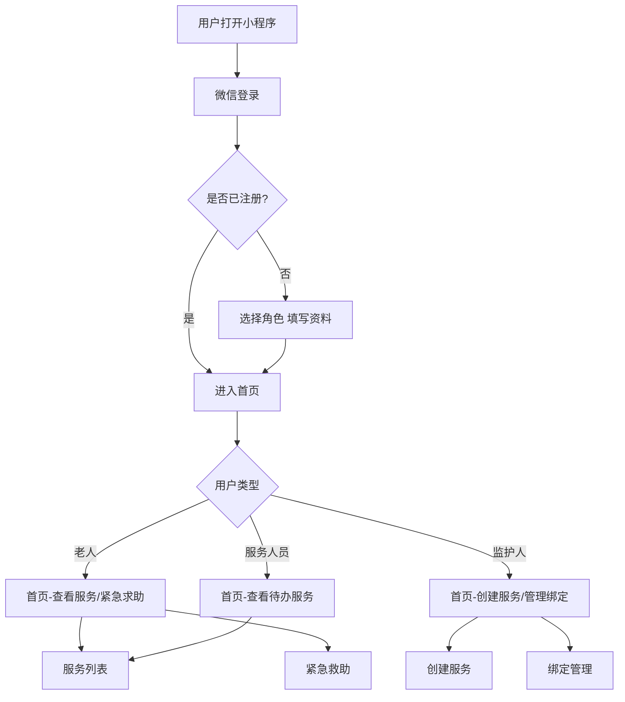
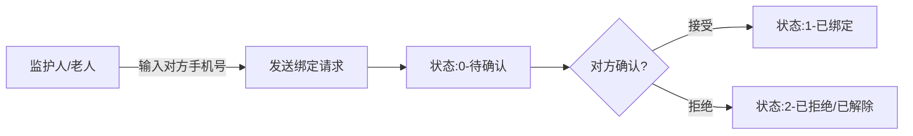
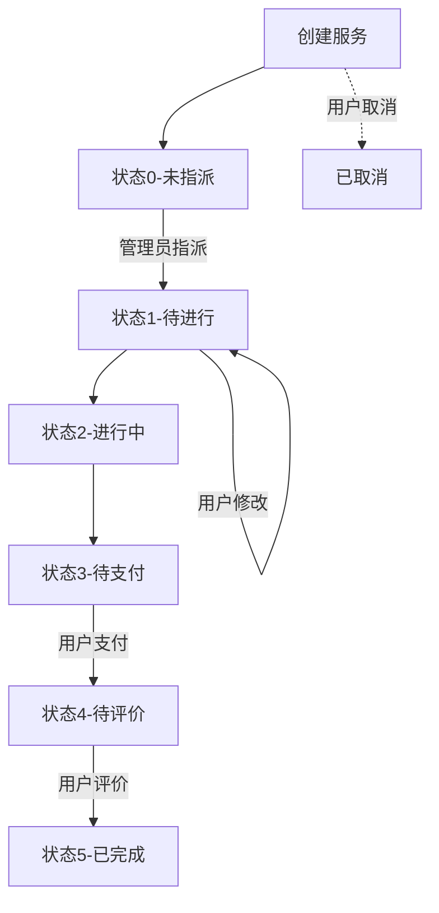

# 智慧养老微信小程序 — 项目技术文档

> 基于微信小程序的智慧养老平台，连接老人、监护人与服务人员

---

## 一、项目概述

本项目是一个面向老年人的智慧养老服务微信小程序，提供**生活照料、医疗护理、心理护理**三大类服务。平台支持三种核心角色：老人（服务受益者）、监护人（服务发起者/监督者）、服务人员（服务执行者）。通过绑定关系建立老人与监护人的连接，实现从服务创建、执行、支付到评价的完整服务闭环，并集成了紧急救助、适老化辅助功能。

---

## 二、业务流程

### 2.1 总体业务流程



### 2.2 用户注册登录流程

```
[微信客户端]                  [后端]                    [微信服务器]
     |                          |                          |
     |-- wx.login() ----------->|                          |
     |                          |-- jscode2session ------->|
     |                          |<-- openid --------------|
     |                          |                          |
     |                          |-- 查询/创建用户 ---------|
     |                          |-- 生成JWT token ---------|
     |<-- {token, userInfo} ----|                          |
     |                          |                          |
     |-- 填写/更新资料 -------->|                          |
     |                          |-- 保存至user表 ----------|
     |<-- {success} ------------|                          |
```

- 用户通过微信静默登录，后端调用微信 `jscode2session` API 获取 `openid`
- 首次登录自动创建用户（userType=99 未注册状态），需完善资料
- 用户类型：**0-老人**、**1-监护人**、**2-日常类员工**、**3-护理类员工**、**4-精神服务类员工**
- JWT Token 有效期 1 小时

### 2.3 绑定流程（老人 ⇄ 监护人）



- 通过手机号搜索对方并发起绑定（不可绑定自己）
- 老人(0) ↔ 监护人(1) 双向绑定
- 双方均可解除绑定关系

### 2.4 服务生命周期



**服务类型**：
- 0-生活照料（助餐、助洁、助浴等）
- 1-医疗护理（测量血压、用药提醒等）
- 2-心理护理（陪伴聊天、心理疏导等）

**各角色在服务中的操作权限**：

| 操作 | 老人(0) | 监护人(1) | 服务人员(2/3/4) |
|------|---------|-----------|-----------------|
| 创建服务 | ✅（为自己） | ✅（为绑定的老人） | ❌ |
| 查看服务 | ✅ | ✅ | ✅ |
| 修改服务 | ✅（未指派/待进行时） | ✅ | ❌ |
| 取消服务 | ✅（自己创建的） | ✅（自己创建的） | ❌ |
| 支付 | ✅（待支付时） | ✅（待支付时） | ❌ |
| 评价 | ✅（待评价时） | ✅（待评价时） | ❌ |
| 上传记录 | ❌ | ❌ | ✅ |

### 2.5 紧急救助流程

```
老人按下"SOS"按钮
         ↓
获取GPS位置 → 获取紧急医疗信息(血型/过敏史/基础疾病)
         ↓
发送紧急求助 → 后端记录求助ID → 通知监护人(待实现)
```

- 入口：首页紧急呼救按钮、紧急呼救信息页
- 仅**老人(0)**用户可见紧急呼救入口
- 上传位置信息（gcj02 坐标系）和求助消息到服务器

---

## 三、数据模型

### 3.1 user（用户表）

| 字段 | 类型 | 说明 |
|------|------|------|
| id | INT (PK, AUTO) | 用户ID |
| open_id | VARCHAR(255) | 微信openid |
| user_type | INT | 0-老人, 1-监护人, 2-日常员工, 3-护理员工, 4-精神服务员工, 99-未注册 |
| nickname | VARCHAR(255) | 昵称 |
| phone_number | VARCHAR(255) | 手机号 |
| address | VARCHAR(255) | 详细地址 |
| region | VARCHAR(255) | 地区 |
| age | INT | 年龄 |
| gender | VARCHAR(255) | 性别 |

### 3.2 service（服务表）

| 字段 | 类型 | 说明 |
|------|------|------|
| service_id | INT (PK, AUTO) | 服务ID |
| service_type | INT | 0-生活照料, 1-医疗护理, 2-心理护理 |
| service_status | INT | 0-未指派, 1-待进行, 2-进行中, 3-待支付, 4-待评价, 5-已完成 |
| service_description | VARCHAR(255) | 服务描述/备注 |
| creator_id | INT (FK→user.id) | 创建者ID |
| target_id | INT (FK→user.id) | 服务对象ID（老人） |
| provider_id | INT (FK→user.id) | 服务提供者ID（服务人员） |
| scheduled_time | DATETIME | 预约时间 |
| appointed_address | VARCHAR(255) | 服务地址 |
| service_evaluation_stars | INT | 评价星级（1-5） |
| service_evaluation_notes | VARCHAR(255) | 评价内容 |
| create_time | DATETIME (自动) | 创建时间 |
| update_time | DATETIME (自动) | 更新时间 |

### 3.3 user_bind（绑定关系表）

| 字段 | 类型 | 说明 |
|------|------|------|
| bind_id | INT (PK, AUTO) | 绑定ID |
| elder_id | INT (FK→user.id) | 老人ID |
| guardian_id | INT (FK→user.id) | 监护人ID |
| initiator_id | INT (FK→user.id) | 发起人ID |
| bind_status | INT | 0-待确认, 1-已绑定, 2-已拒绝/已解除 |
| create_time | DATETIME (自动) | 创建时间 |
| update_time | DATETIME (自动) | 更新时间 |

### 3.4 emergency（紧急医疗信息表）

| 字段 | 类型 | 说明 |
|------|------|------|
| emergency_id | INT (PK, AUTO) | 紧急信息ID |
| user_id | INT (FK→user.id) | 用户ID（老人） |
| blood_type | VARCHAR(255) | 血型 |
| allergies | VARCHAR(255) | 过敏史 |
| basic_diseases | VARCHAR(255) | 基础疾病 |
| surgery_history | VARCHAR(255) | 手术史 |
| medication | VARCHAR(255) | 当前用药 |
| emergency_notes | VARCHAR(255) | 紧急备注 |

---

## 四、API 接口总览

### 4.1 用户认证

| 方法 | 路径 | 说明 |
|------|------|------|
| POST | `/login` | 微信登录（传code，返回token+用户信息） |
| POST | `/signup` | 注册/完善用户信息（需token） |

### 4.2 服务管理

| 方法 | 路径 | 说明 |
|------|------|------|
| GET | `/api/services` | 获取服务列表（分页，支持状态筛选） |
| GET | `/api/services/{id}` | 获取服务详情 |
| POST | `/api/services/create` | 创建服务 |
| POST | `/api/services/update/{id}` | 更新服务 |
| POST | `/api/services/cancel/{id}` | 取消服务 |
| POST | `/api/services/evaluate/{id}` | 评价服务 |
| POST | `/api/services/payment/{id}` | 支付服务 |

### 4.3 绑定管理

| 方法 | 路径 | 说明 |
|------|------|------|
| GET | `/api/bindings` | 获取当前用户绑定列表 |
| POST | `/api/bindings/create` | 创建绑定申请 |
| PUT | `/api/bindings/{id}/status` | 更新绑定状态（接受/拒绝） |
| POST | `/api/bindings/delete/{id}` | 解除绑定 |

### 4.4 紧急救助

| 方法 | 路径 | 说明 |
|------|------|------|
| GET | `/api/emergency/info` | 获取紧急医疗信息 |
| POST | `/api/emergency/update` | 更新紧急医疗信息 |
| POST | `/api/emergency/help` | 发送紧急求助 |

---

## 五、技术栈分析

### 5.1 前端技术栈

| 技术 | 用途 | 版本 |
|------|------|------|
| **微信小程序** | 前端框架 | 原生开发 |
| WXML | 页面模板 | - |
| WXSS | 页面样式 | - |
| JavaScript (ES6) | 业务逻辑 | - |
| 微信 SDK | 登录、定位、支付等原生能力 | - |

### 5.2 后端技术栈

| 技术 | 用途 | 版本 |
|------|------|------|
| **Java** | 开发语言 | 17+（本地有 21） |
| **Spring Boot** | 应用框架 | 3.4.6 |
| **Spring Data JPA** | ORM / 数据访问 | (Hibernate) |
| **MySQL** | 数据库 | 8.x |
| **MySQL Connector** | JDBC驱动 | 8.0.33 |
| **JWT (jjwt)** | 用户认证令牌 | 0.11.5 |
| **Hutool HTTP** | HTTP客户端（调用微信API） | 5.8.13 |
| **Lombok** | 代码简化（@Data等） | 1.18.30 |
| **Jackson** | JSON处理 | 2.15.2 |
| **JAXB** | XML绑定（JWT需要） | 2.3.0 |
| **Maven** | 构建工具 | (使用mvnw wrapper) |
| **Actuator** | 应用监控 | Spring Boot内置 |

### 5.3 本地环境检查结果

| 组件 | 所需版本 | 本地状态 | 操作建议 |
|------|---------|---------|---------|
| **Java** | 17+ | ✅ JDK 21 | 无需操作 |
| **Node.js** | 16+ | ✅ v24.15.0 | 无需操作 |
| **npm** | 8+ | ✅ 11.12.1 | 无需操作 |
| **Maven** | 3.6+ | ❌ 未全局安装 | 使用项目自带的 `mvnw` 脚本即可（无需全局安装） |
| **MySQL** | 8.x | ❌ 未安装 | ⚠️ **需要安装 MySQL 8.x**（配置为连接远程服务器 47.109.145.84，也可连接本地） |
| **微信开发者工具** | 最新 | ❌ 未检测 | ⚠️ **需要安装**：开发调试微信小程序必需 |

---

## 六、本地开发环境搭建指南

### 6.1 必须安装的软件

#### 1. MySQL 8.x
```bash
# 方式一：官网下载安装
# https://dev.mysql.com/downloads/installer/
#
# 方式二：使用 Docker（推荐）
docker run -d \
  --name mysql8 \
  -e MYSQL_ROOT_PASSWORD=root \
  -e MYSQL_DATABASE=MiniApp \
  -p 3306:3306 \
  mysql:8
```

#### 2. 微信开发者工具
- 下载地址：https://developers.weixin.qq.com/miniprogram/dev/devtools/download.html
- 导入 `前端/miniprogram-1` 目录

### 6.2 启动后端

```bash
# 1. 创建数据库（确保 MySQL 运行中）
mysql -u root -p -e "CREATE DATABASE IF NOT EXISTS MiniApp DEFAULT CHARSET utf8mb4;"

# 2. 修改数据库配置（可选）
# 编辑 后端/mini_program_backend/src/main/resources/application.properties
# 将数据库地址改为本地：jdbc:mysql://localhost:3306/MiniApp

# 3. 使用 Maven Wrapper 启动
cd 后端/mini_program_backend
./mvnw spring-boot:run
```

### 6.3 启动前端
- 使用微信开发者工具打开 `前端/miniprogram-1/miniprogram-1` 目录
- 需申请微信小程序的 AppID（或在开发者工具中使用"测试号"）
- 如需修改后端地址，编辑 `config.js` 中的 `baseUrl`

---

## 七、项目目录结构

```
养老微信小程序/
├── 前端/
│   └── miniprogram-1/
│       ├── miniprogram-1/           # 小程序源码
│       │   ├── app.js               # 全局入口（网络监听、全局数据）
│       │   ├── app.json             # 全局配置（页面路由、tabBar）
│       │   ├── app.wxss             # 全局样式
│       │   ├── config.js            # API地址配置（dev/prod）
│       │   ├── pages/
│       │   │   ├── login/           # 登录页
│       │   │   ├── signup/          # 注册/完善信息页
│       │   │   ├── index/           # 首页
│       │   │   ├── info/            # 个人中心页（我的）
│       │   │   ├── service_list/    # 服务列表页
│       │   │   ├── service_create/  # 创建/编辑服务页
│       │   │   ├── service_detail/  # 服务详情页
│       │   │   ├── service_evaluate/# 服务评价页
│       │   │   ├── bind_list/       # 绑定管理页
│       │   │   ├── bind_edit/       # 添加绑定页
│       │   │   ├── emergency/       # 紧急医疗信息页
│       │   │   ├── emergency_info/  # 紧急救助页面
│       │   │   ├── complaint/       # 投诉建议页
│       │   │   └── accessibility/   # 适老化设置页
│       │   ├── resources/           # 图标资源
│       │   └── utils/               # 工具函数
│       ├── frontend-fixes/          # 前端修复说明
│       ├── API_Documentation.md     # API文档
│       └── test_case.md             # 测试用例
│
├── 后端/
│   └── mini_program_backend/
│       ├── pom.xml                  # Maven依赖配置
│       ├── mvnw / mvnw.cmd          # Maven Wrapper
│       ├── src/main/java/com/hecs/mini_program_backend/
│       │   ├── MiniProgramBackendApplication.java  # 启动类
│       │   ├── config/
│       │   │   ├── WeChatConfig.java    # 微信配置（appid/secret）
│       │   │   └── WebConfig.java       # CORS跨域配置
│       │   ├── controller/
│       │   │   ├── LoginController.java # 微信登录
│       │   │   ├── SignUpController.java # 注册/注销
│       │   │   ├── ServiceController.java # 服务CRUD
│       │   │   ├── BindController.java  # 绑定关系
│       │   │   └── EmergencyController.java # 紧急救助
│       │   ├── entity/
│       │   │   ├── User.java
│       │   │   ├── Service.java
│       │   │   ├── Bind.java
│       │   │   └── Emergency.java
│       │   ├── mapper/                  # JPA Repository
│       │   ├── service/                 # 业务逻辑层
│       │   └── utils/
│       │       ├── TokenGenerate.java   # JWT生成
│       │       └── TokenParse.java      # JWT解析
│       └── src/main/resources/
│           └── application.properties   # 数据库/微信配置
│
├── 数据词典.pdf                      # 数据库字典
└── 马一博小组_系统测试用例与记录表.docx  # 测试用例文档
```

---

## 八、注意事项

1. **微信配置**：`application.properties` 中的 `wechat.appid` 和 `wechat.appsecret` 需替换为自己的微信小程序凭证
2. **数据库密码**：当前配置中是远程服务器的正式密码，本地开发建议修改
3. **CORS配置**：后端已配置允许所有跨域来源（方便开发调试）
4. **JWT密钥**：当前使用硬编码签名 `com.hecs.mini_program_backend.utils`，生产环境应替换为安全密钥
5. **支付功能**：当前支付为模拟实现（前端setTimeout模拟），未对接微信支付
6. **紧急求助**：当前仅返回 `helpId`，未实际通知监护人，需后续对接消息推送
7. **服务人员指派**：当前创建服务时写死 `providerId=5`，需等待管理员指派逻辑
8. **前端兼容**：前端做了大量字段名映射以兼容不同版本的服务数据格式（`id/serviceId`, `type/serviceType` 等）

---

> 文档版本：v1.0 | 生成日期：2026-05-30
